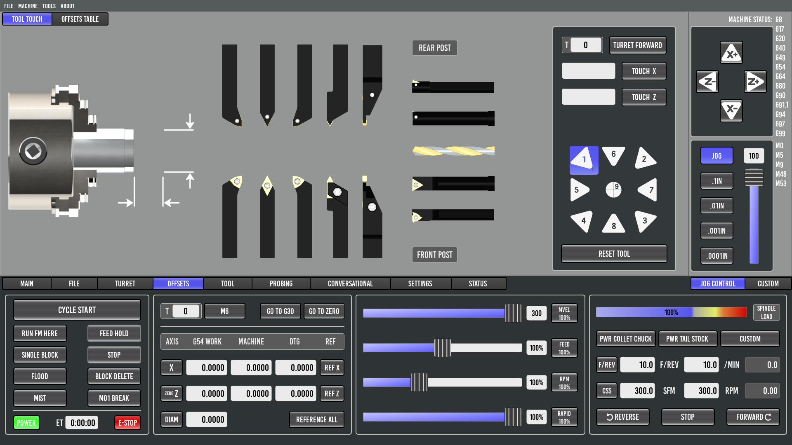

==========
Lathe VCPs
==========

Examples of lathe VCPs made using QtPyVCP

Probe Basic Lathe
-----------------

| **Project URL:** https://github.com/kcjengr/probe_basic
| **Install:** ``sudo apt install python3-probe-basic`` (installs Probe Basic and Probe Basic Lathe), after :doc:`adding the apt repository </install/apt_install>`
