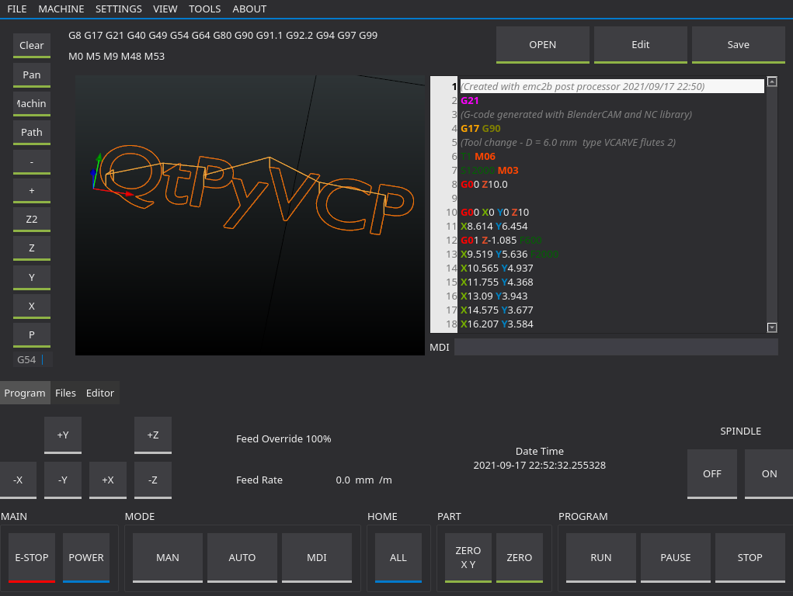

=========
Mill VCPs
=========

Examples of mill VCPs made using QtPyVCP

Probe Basic
-----------

.. image:: https://forum.linuxcnc.org/media/kunena/attachments/21571/3ATCPage.jpg
   :align: center

| **Project URL:** https://github.com/kcjengr/probe_basic
| **Install:** ``sudo apt install python3-probe-basic``, after :doc:`adding the apt repository </install/apt_install>`

TurboNC
-------

| **Project URL:** https://github.com/kcjengr/turbonc
| **Install:** ``sudo apt install python3-turbonc``, after :doc:`adding the apt repository </install/apt_install>`
