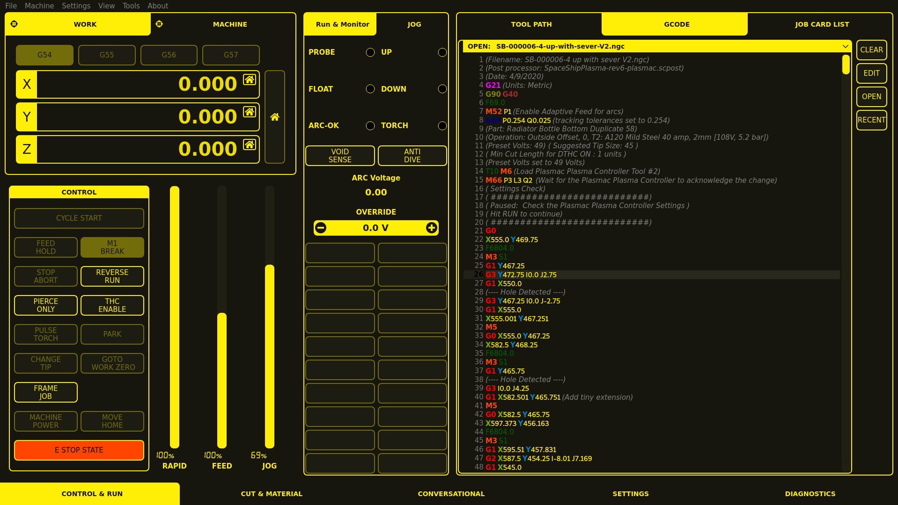

===========
Plasma VCPs
===========

Examples of plasma VCPs made using QtPyVCP

Monokrom
--------

| **Project URL:** https://github.com/kcjengr/monokrom
| **Install:** ``sudo apt install python3-monokrom``, after :doc:`adding the apt repository </install/apt_install>`
