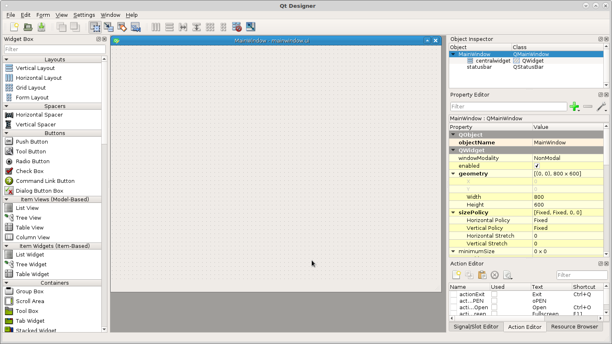
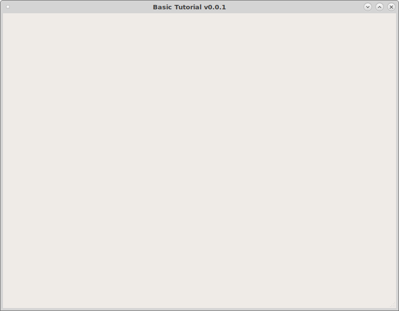

=================
Clone and Prepare
=================

.. Note::
    The following tutorial was done using Debian 9 (Stretch).

Before cloning you should have installed QtPyVCP as shown on the
:doc:`../install/quick_start` page.

To start with you should clone the `VCP Template`. It has all the basic
structure needed to build a VCP. In a terminal::

    git clone https://github.com/kcjengr/vcp-template.git

To make copy the `VCP Template` for this tutorial in the terminal first change
to the `vcp-template` directory then run `tutorial.sh` and use a new name that
contains only letters, numbers and the underscore _. For this tutorial I used
`vcp1` so all examples will use that name. Pick yes to copy the LinuxCNC
Configuration files.
::

    cd vcp-template
    ./tutorial.sh

To edit the new template created from the vcp-template run the following command
in a terminal. In this example the copied vcp-template was named `vcp1`.
::

    editvcp vcp1

Now the `VCP Template` is open in the `Qt Designer`.

**Testing the VCP**

To test your vcp start LinuxCNC and pick the vcp1 configuration. Make sure you
check off `Create Desktop Shortcut` so you can launch the VCP with one click.

.. image:: images/vcp1-config-selector.png
   :align: center
   :scale: 60 %

Now you can see a blank VCP with a menu added.

.. image:: images/vcp1-run-01.png
   :align: center
   :scale: 60 %

Navigate to the vcp location `~/vcp1/vcp1` and open the `config.yml` file with a
text editor. Here you can change the author, version, description. Change the
line `menu: ( default_menubar )` to `menu: null` and save the file. Now run the
vcp1 configuration and you see the menu has disappeared as this is a touch
screen tutorial we don't want a menu.

The `mainwindow.py` is the file to add any custom methods.

.. Note::
    Python uses indentation to define blocks of code. You should not mix spaces
    and tabs in the same file.

The `style.qss` is a place to put css styles. In the following example it is for
an `ActionButton` with the `actionName` of machine.estop.toggle and when it is
checked change the background color to red. The important thing to note is the
`checked`, by default an action button is not checkable so for this to work you
must select that in the `Property Editor`.

.. code-block:: css

    ActionButton[actionName="machine.estop.toggle"]:checked{
        background: rgb(239, 41, 41);
    }

