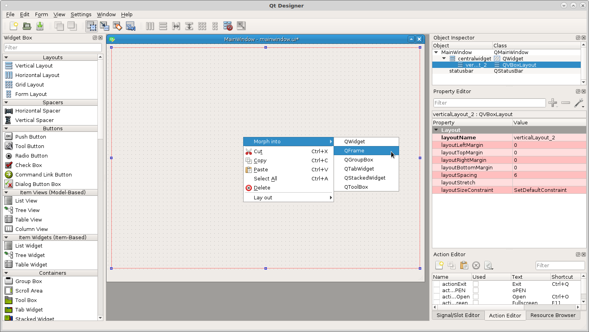
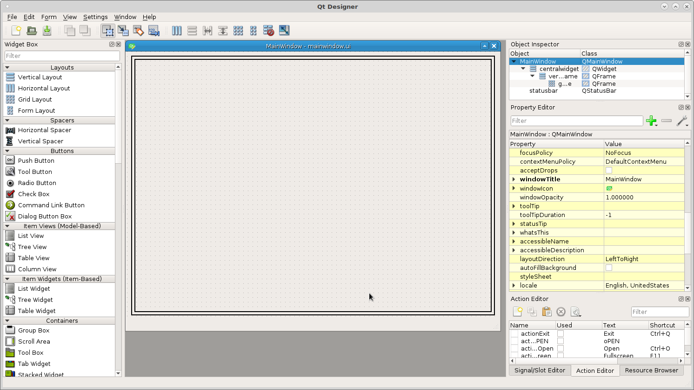
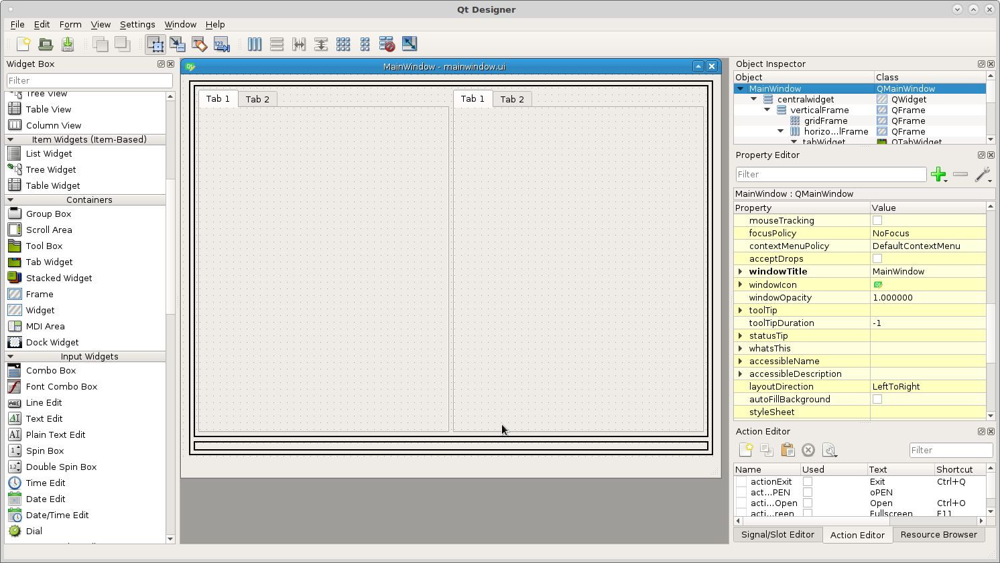
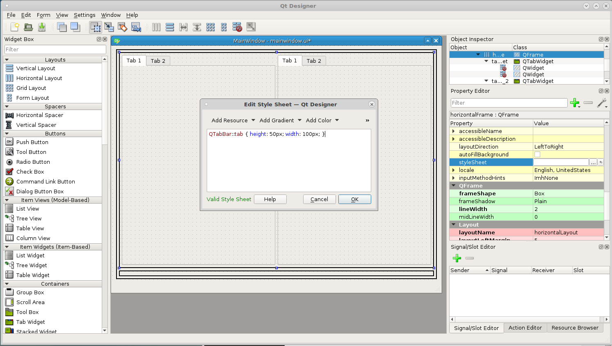
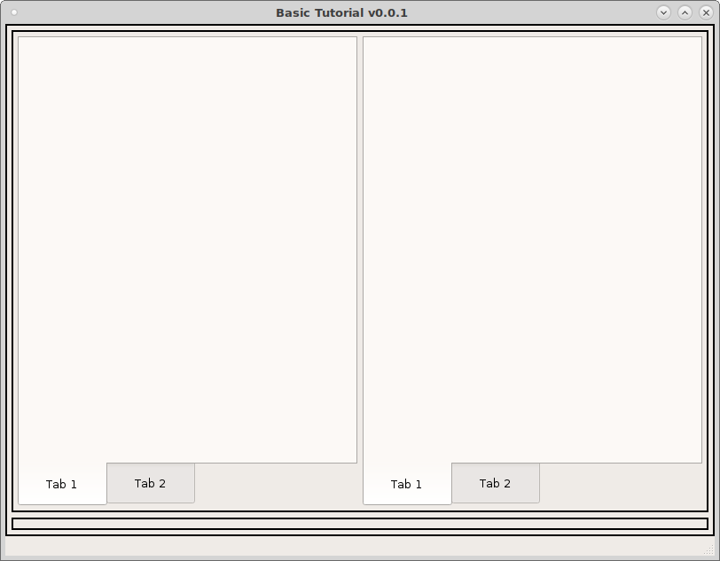

================
Setup the Layout
================

The first thing to do is figure out the general layout of the screen and put
some layouts in and morph them into frames. I'm going to start with a
`Vertical Layout` because I want the bottom row of control buttons to be visible
at all times. Drag a `Vertical Layout` into the main window and right click on
it and morph into a `QFrame`.

In the `Property Editor` on the right side change the Frame Shape from
`No Frame` to a `Box` and change the margins (left, right, top and bottom) to 5,
this makes it easier to see the blue line when dragging other layouts into the
frame.

.. image:: images/vcp1-designer-03.png
   :align: center
   :scale: 40 %

Now drag a grid layout into the vertical frame and change it as above. Now you
can see the space between the inner and outer frames very well.

Now drag a horizontal layout above the grid and inside the vertical layout and
change as above.

.. image:: images/vcp1-designer-05.png
   :align: center
   :scale: 40 %

Now drag two `Tab Widgets` into the top horizontal layout and notice the bottom
frame is now much smaller but you can still see it well enough to drag items
into it.

Now we want to change the tab widgets to be more touch screen friendly. To set
the size of tabs in a `Tab Widget` add the following into the 
`QFrame styleSheet` that has the Tab Widgets in it. This is how you change the
style of everything in a container in one place.
::

    QTabBar::tab {
    height: 50px; width: 90px;
    font: 14pt "DejaVu Sans"; }

This will set the size of the tabs larger and easier to press with your finger.
Also change the location of the tabs to the `South` position so you can see the
tab as you change from tab to tab.

Here is our completed layout running.

