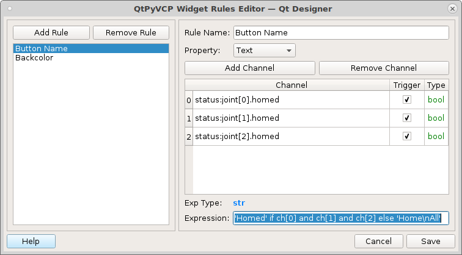
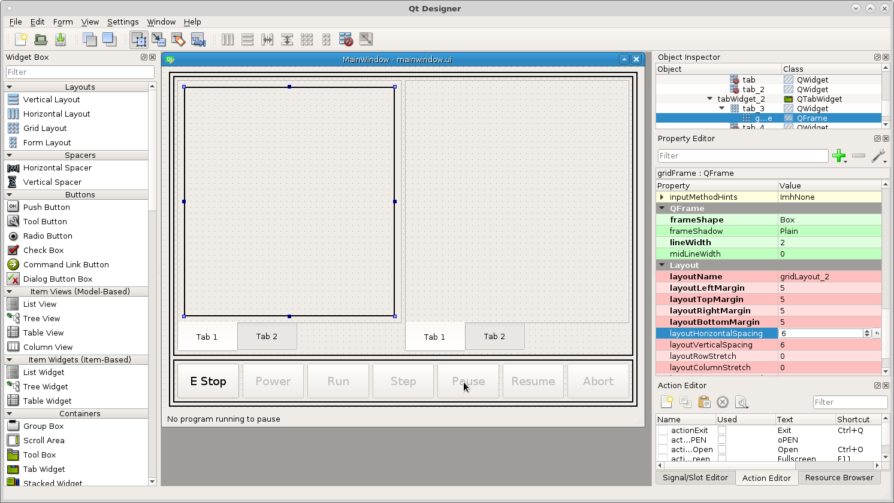

================
Machine Controls
================

Start by dragging a three of action buttons in the bottom frame. We want all
buttons in this frame to have a minimum height and width of 50 pixels and the
font size to be 14pt so in the stylesheet for the frame put the following.::

    .ActionButton {
        min-height: 50px;
        min-width: 50px;
        font: 14pt "DejaVu Sans";
    }

.. image:: images/vcp1-designer-08.png
   :align: center
   :scale: 40 %

From left to right add the following to the `actionName` of each button::

    machine.estop.toggle
    machine.power.toggle
    machine.home.all

Name the left button `E Stop` and the middle button `Power`. The `Home All`
button will get its name from the rule.

Make sure you check off the `checkable` box for E Stop and Power buttons, this
makes them a toggle button.

Now we need to add a couple of rules to the right `Home All` button. The first
rule will set the text of the button based on if all the joints are homed or
not. Double click on the button to open the `Rules Editor` and add a new rule.
The `Property` is Text. Add three channels with the following and make sure
`Trigger` is checked in each one.::

    status:joint[0].homed
    status:joint[1].homed
    status:joint[2].homed

The expression to change the text of the button is::

    'Homed' if ch[0] and ch[1] and ch[2] else 'Home\nAll'

Notice that 'Home\\nAll' has a new line character `\\n` in it.

The second rule will have the same channels with the following expression::

    "background-color:rgb(138, 226, 52)" if ch[0] and ch[1] and ch[2] else ''

Now when we run the VCP you can see the buttons in
action.

.. image:: images/vcp1-run-04.png
   :align: center
   :scale: 60 %

To see the styles for machine buttons look in `vcp1/vcp1/ui/style.css and you
see the how the styles are applied using the style.qss file. For example the
style for the E Stop button is applied with the following. Notice that the type
of widget is an `ActionButton` and the specfic button is on with an `actionName`
machine.estop.toggle.::

    ActionButton[actionName="machine.estop.toggle"]:checked{
        background: rgb(239, 41, 41);
    }

Now lets add the rest of the machine buttons so add five more `ActionButtons` to
the right of the Home button and name them Run, Step, Pause, Resume, and Abort.

The `actionNames` are::

    program.run
    program.step
    program.pause
    program.resume
    program.abort

Now we have the machine buttons complete.

.. image:: images/vcp1-run-05.png
   :align: center
   :scale: 60 %

The program buttons will not be enabled until we load a program.
