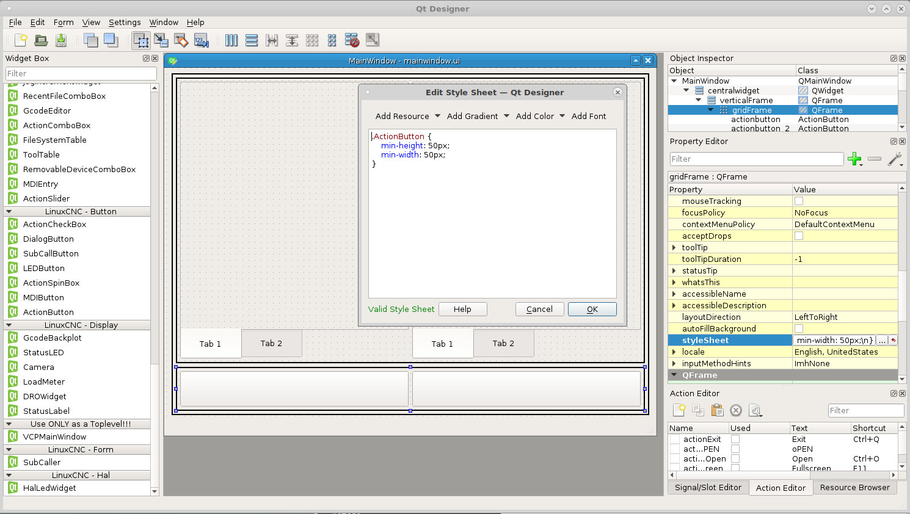
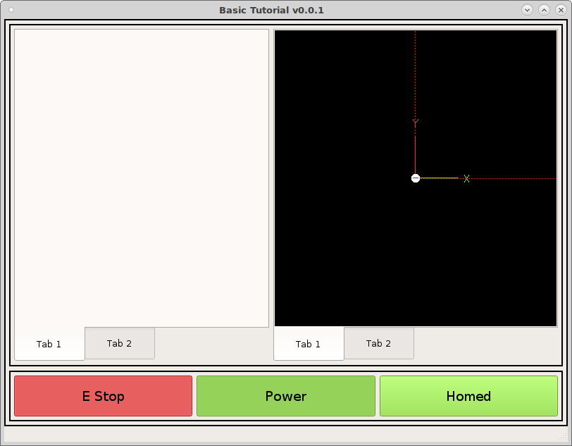
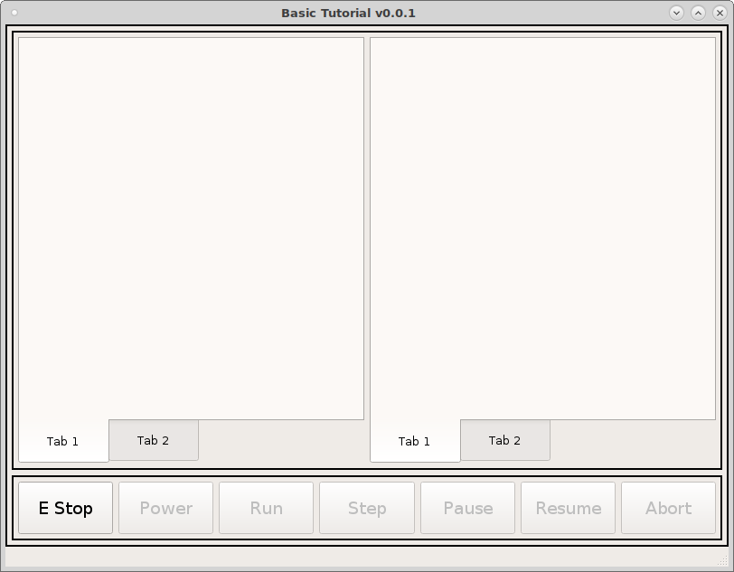

================
Machine Controls
================

Start by dragging a couple of action buttons in the bottom frame. We want all
buttons in this frame to have a minimum height and width of 50 pixels so in the
stylesheet for the frame put the following.::

    .ActionButton {
        min-height: 50px;
        min-width: 50px;
    }

Now add ``machine.estop.toggle`` to the left button `actionName` and ``machine.power.toggle`` to the right button `actionName`. Add text to each
button and change the font size to 14. Make sure you check off the `checkable`
box for both buttons, this makes them a toggle button. Now when we run the VCP
you can see the buttons in action.

To see the styles for machine buttons look in `vcp1/vcp1/ui/style.css and you
see the how the styles are applied using the style.qss file. For example the
style for the E Stop button is applied with the following. Notice that the type
of widget is an `ActionButton` and the specfic button is on with an `actionName`
machine.estop.toggle.::

    ActionButton[actionName="machine.estop.toggle"]:checked{
        background: rgb(239, 41, 41);
    }

Now lets add the rest of the machine buttons so add five more `ActionButtons` to
the right of the Power button and name them Run, Step, Pause, Resume, and Abort.

The `actionNames` are::

    program.run
    program.step
    program.pause
    program.resume
    program.abort

Now we have the machine buttons complete.

