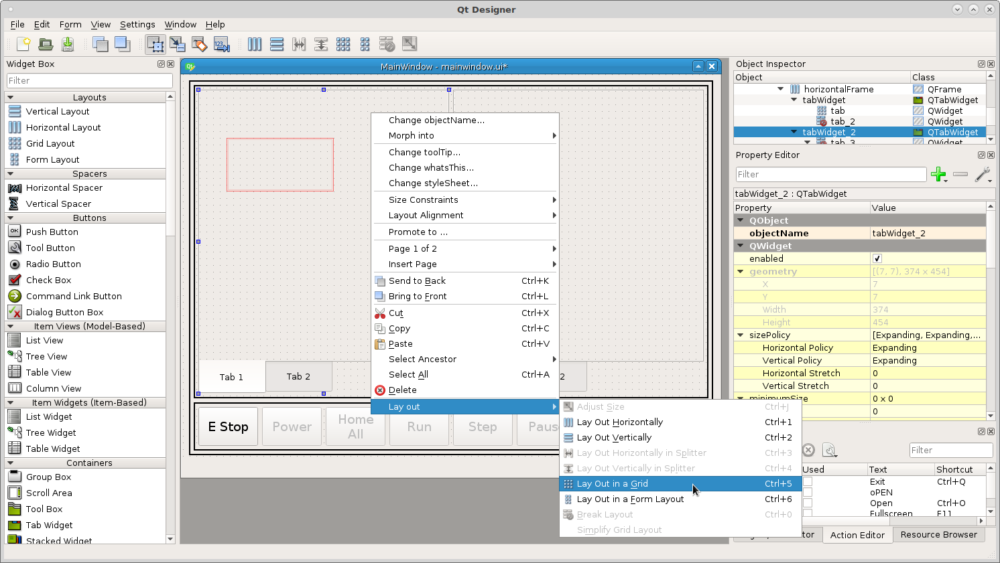
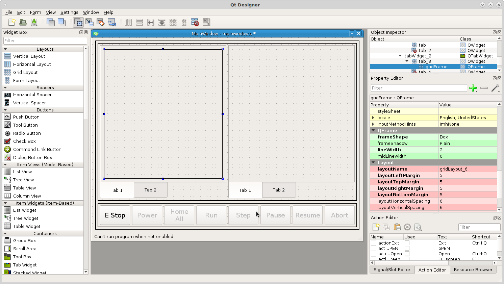
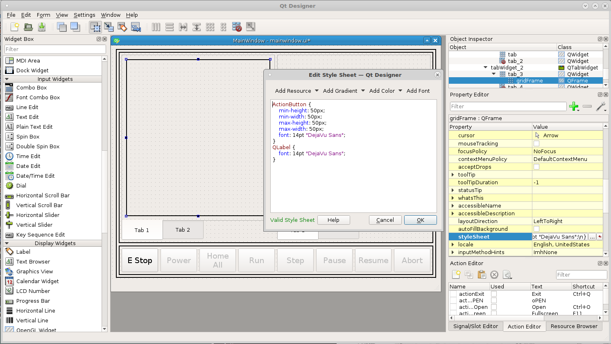
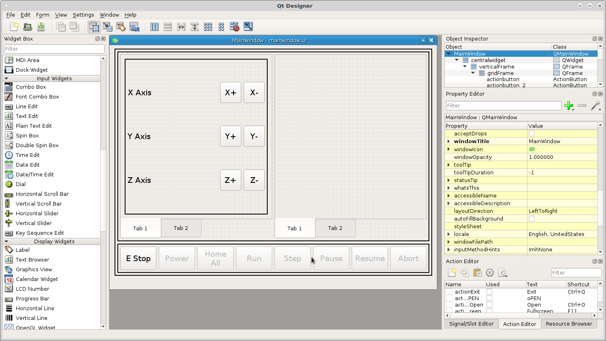
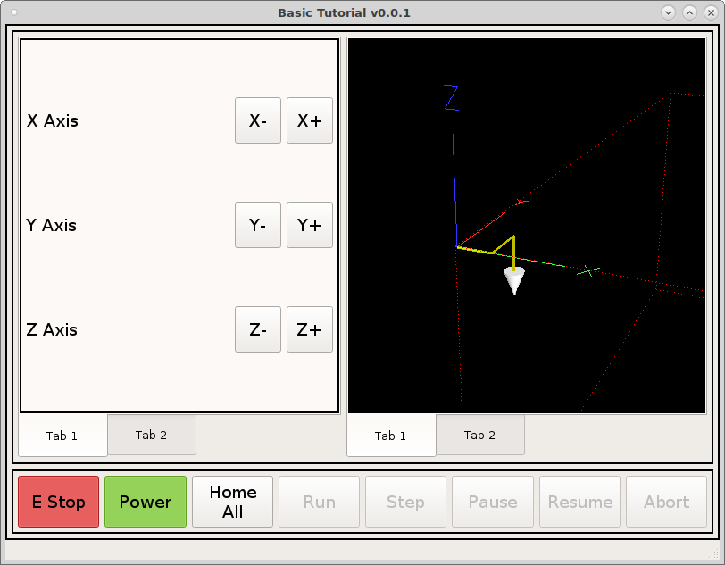
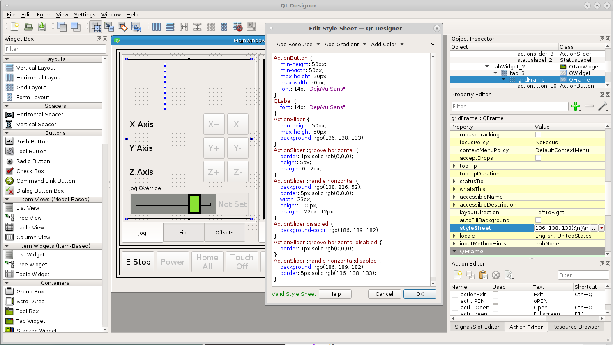
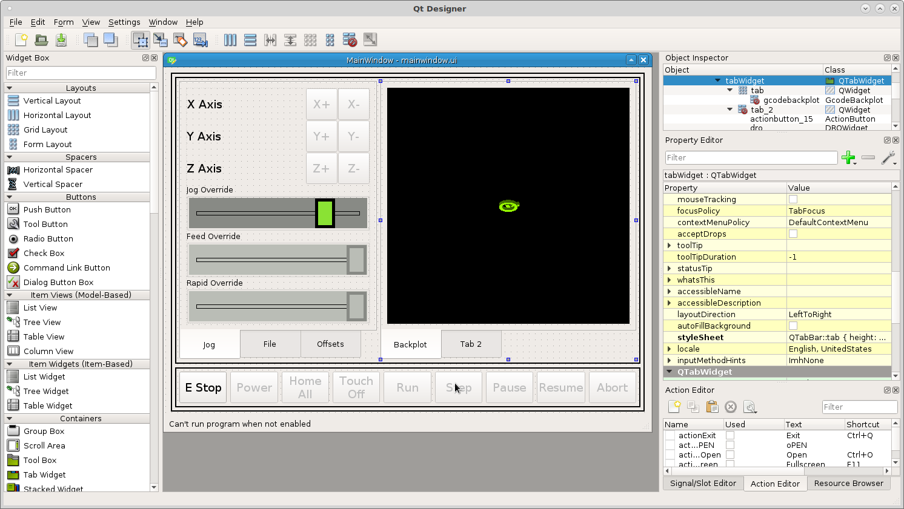
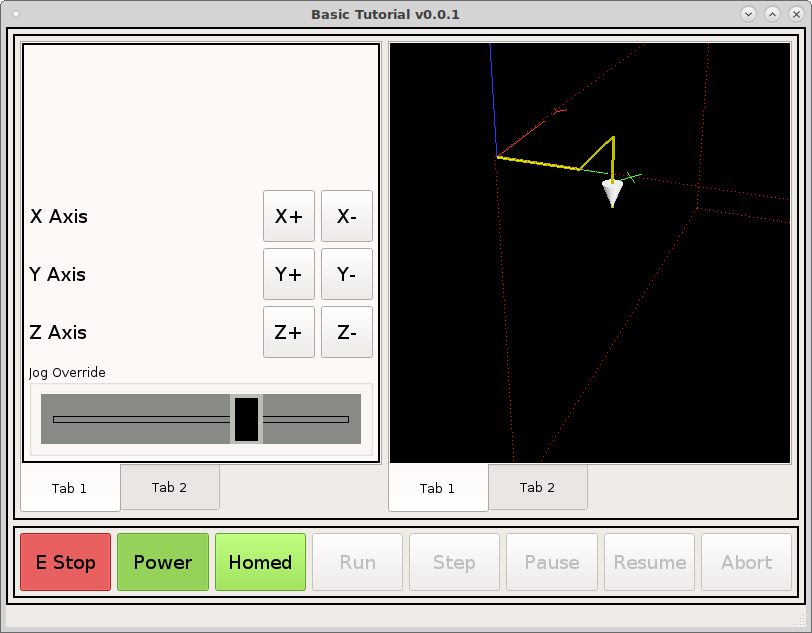
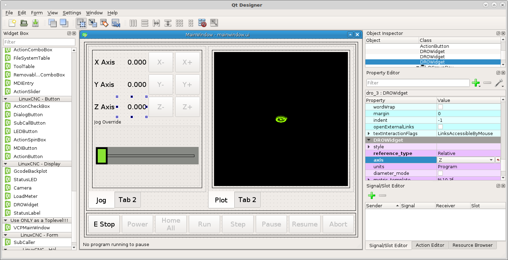
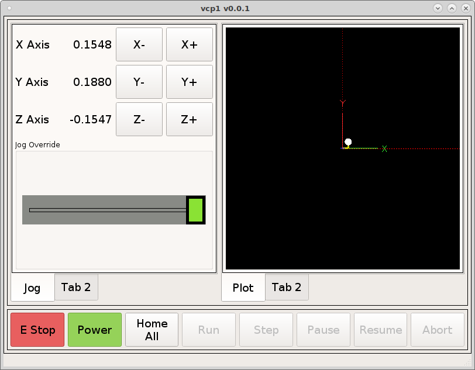

===========
Jog and DRO
===========

In our left Tab Widget Tab 1 lets add some jog controls, drag a grid layout into
the tab then right click in the tab (not the grid layout) and select layout in a
grid. This will cause the grid layout to fill the tab.

Make the same changes to the frame as before morph into QFrame, box frame,
margins 5.

In the `QFrame` of Tab 1 we want the `QLabels` text to be 14pt font so open the
stylesheet for the grid layout and add the following
::

    QLabel {font: 14pt "DejaVu Sans";}

Notice how we set the `QLabel` font inside the frame, if we wanted to set all
`QLabels` we could set this in the `QMaineWindow`.

Now lets drag some `actionButtons` into the left panel for jogging controls and
some standard labels from the `Display Widgets` for each axis and change the
text to match the following.

Add the following `actionNames` to the jog buttons.
::

    machine.jog.axis:x,neg
    machine.jog.axis:x,pos
    machine.jog.axis:y,neg
    machine.jog.axis:y,pos
    machine.jog.axis:z,neg
    machine.jog.axis:z,pos

Notice how the buttons become disabled as you add the actionNames. The action is
controlling the button enable.

In the right hand `QTabWidget` do as above and drag a grid into Tab 1 and set
the layout to grid and change to a box frame and the margins to 5. Now drag a
`GcodeBackplot` into the frame so you can see it move when you jog.

To change the tab name select the tab widget and change the `current tab name`.

.. Note::
    At this time the jog slider is being worked on so skip this section for now.

Drag a grid layout below the jog buttons in the tab. Drag the edge until it
fills the tab left to right and morph it into a `QGroupBox` and set the title to
`Jog Override`.

Now we need to make a jog speed slider, drag an `ActionSlider` into the group
box and change orientation to horizontal.

Now put ``machine.jog.set-linear-speed`` in the `ActionSlider` actionName.

Now add the following to the `QMainWindow` stylesheet because we want all the
`Action Sliders` to have the same style.
::

    ActionSlider {
    min-height: 50px;
    max-height: 50px;
    background: rgb(136, 138, 133);
    }
    ActionSlider::groove:horizontal {
    border: 1px solid rgb(0,0,0);
    height: 5px;
    margin: 0 12px;
    }
    ActionSlider::handle:horizontal {
    background: rgb(138, 226, 52);
    border: 5px solid rgb(0,0,0);
    width: 23px;
    height: 100px;
    margin: -22px -12px;
    }
    ActionSlider:disabled {
    background-color: rgb(186, 189, 182);
    }
    ActionSlider::groove:horizontal:disabled {
    border: 1px solid rgb(0,0,0);
    }
    ActionSlider::handle:horizontal:disabled {
    background: rgb(186, 189, 182);
    border: 5px solid rgb(136, 138, 133);
    }

The first three handle the size, border and enabled colors and the last three
handle the disabled colors.

Now we can see the slider in action.

.. Note::
    At this time the jog slider is not complete so it does not go disabled.

**DRO**

Add a `DROWidget` between the jog buttons and the axis labels and set the axis
and the reference_type to `Relative` and select the correct axis for each one.

Now when we run the VCP we can see the DRO's change when we jog an axis.

You can also use a `StatusLabel` to display position. Create a rule for the
`StatusLabel` and add a channel from the position plugin and the expression is
``ch[0]``. The following example is for relative position and the X axis.
::

    position:rel?string&axis=x

See the :doc:`../plugins/positions` page for more information on setting
position display options.
