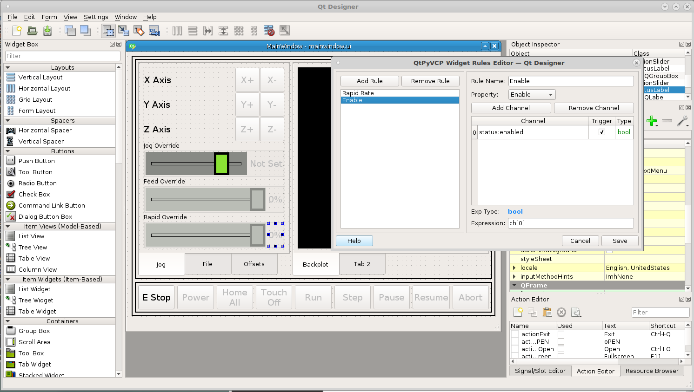
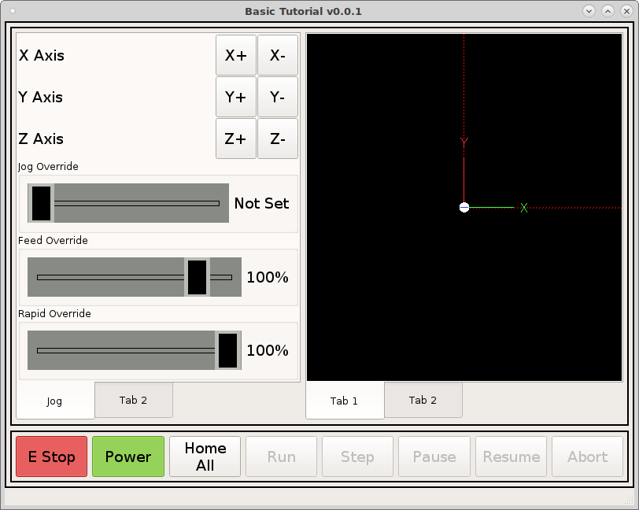

=================
Jog and Overrides
=================

In our left tab1 lets add some jog controls, drag a grid layout into the tab
then right click in the tab (not the grid layout) and select layout in a grid.
This will cause the grid layout to fill the tab.

.. image:: images/vcp1-designer-11.png
   :align: center
   :scale: 40 %

Make the same changes to the frame as before morph into QFrame, box frame,
line width 2, margins 5.

.. image:: images/vcp1-designer-12.png
   :align: center
   :scale: 40 %

In the left tab we want the buttons to be 50 x 50 px and the text to be 14pt
font so open the stylesheet for the grid layout and add the following::

    ActionButton {
        min-height: 50px;
        min-width: 50px;
        max-height: 50px;
        max-width: 50px;
        font: 14pt "DejaVu Sans";
    }
    QLabel {
        font: 14pt "DejaVu Sans";
    }

Notice how we set both the `QLabel` and the `ActionButton` font, if we wanted to
we could change the labels to be a different font than the buttons.

.. image:: images/vcp1-designer-13.png
   :align: center
   :scale: 40 %

Now lets drag some `actionButtons` into the left panel for jogging controls and
some standard labels from the `Display Widgets` for each axis.

.. image:: images/vcp1-designer-14.png
   :align: center
   :scale: 40 %

Add the following `actionNames` to the jog buttons.::

    machine.jog.axis:x,pos
    machine.jog.axis:x,neg
    machine.jog.axis:y,pos
    machine.jog.axis:y,neg
    machine.jog.axis:z,pos
    machine.jog.axis:z,neg

Drag a `GcodeBackplot` into the right frame so you can see it move when you jog.
Right click in the tab and select `Layout in a Grid` so the backplot fills the
tab.

To change the tab name select the tab widget and change the `current tab name`.

.. image:: images/vcp1-run-06.png
   :align: center
   :scale: 60 %

Drag a grid layout below the jog buttons in the tab. Drag the edge until it
fills the tab left to right and morph it into a `QGroupBox` and set the title to
`Jog Override`.

.. image:: images/vcp1-designer-15.png
   :align: center
   :scale: 40 %

Now we need to make a jog speed slider, drag an `ActionSlider` into the group
box and change orientation to horizontal and set the value at 80.

Now put ``machine.jog.set-linear-speed`` in the `ActionSlider` actionName.

Now add the following to the grid stylesheet because we want all the
`Action Sliders` in this frame to have the same style.
::

    ActionSlider {
        min-height: 50px;
        max-height: 50px;
        background: rgb(136, 138, 133);
    }
    ActionSlider::groove:horizontal {
        border: 1px solid rgb(0,0,0);
        height: 5px;
        margin: 0 12px;
    }
    ActionSlider::handle:horizontal {
        background: rgb(138, 226, 52);
        border: 5px solid rgb(0,0,0);
        width: 23px;
        height: 100px;
        margin: -22px -12px;
    }
    ActionSlider:disabled {
        background-color: rgb(186, 189, 182);
    }
    ActionSlider::groove:horizontal:disabled {
        border: 1px solid rgb(0,0,0);
    }
    ActionSlider::handle:horizontal:disabled {
        background: rgb(186, 189, 182);
        border: 5px solid rgb(136, 138, 133);
    }

The first three handle the size, border and enabled colors and the last three
handle the disabled colors.

.. image:: images/vcp1-designer-16.png
   :align: center
   :scale: 40 %

Now we can see the slider in action.

.. Note::
    At this time the jog slider is not complete so it does not go disabled.

.. image:: images/vcp1-run-07.png
   :align: center
   :scale: 60 %

Add two more grid layouts below the Jog Override and morph them into
QGroupBoxes. In order for this all to fit in the QFrame you need to set the
top and bottom margins and vertical spacing to 1 and we no longer need the box
so that can be removed. Add ActionSliders in each box and actionNames are
``machine.feed-override.set`` and ``machine.rapid-override.set``

.. image:: images/vcp1-designer-17.png
   :align: center
   :scale: 40 %

Now add `StatusLabels` to the side of the overrides. For the rapid override
status label add a rule for text with the channel ``status:rapidrate`` and the
expression is ``"{}%".format(int(ch[0]*100))``. I know that looks like gobbly
goop but how that reads is "{replace the braces with the format results}%" and
the format(change to an integer(channel 0 times 100)) The overrides are 1 = 100%
so we multiply them by 100 to get a logical number. For the feed override the
channel is ``status:feedrate`` and the expression is the same as rapid.

Now when we run the VCP we can see the percent of overrides change.

.. image:: images/vcp1-run-08.png
   :align: center
   :scale: 60 %

Add another rule to each status label with the property `Enabled` and the
channel is ``status:enabled`` and the expression is ``ch[0]``. This gives us
another clue that the slider is disabled until the power is on.

.. image:: images/vcp1-designer-19.png
   :align: center
   :scale: 40 %

Now when we run the VCP we can see the changes.

