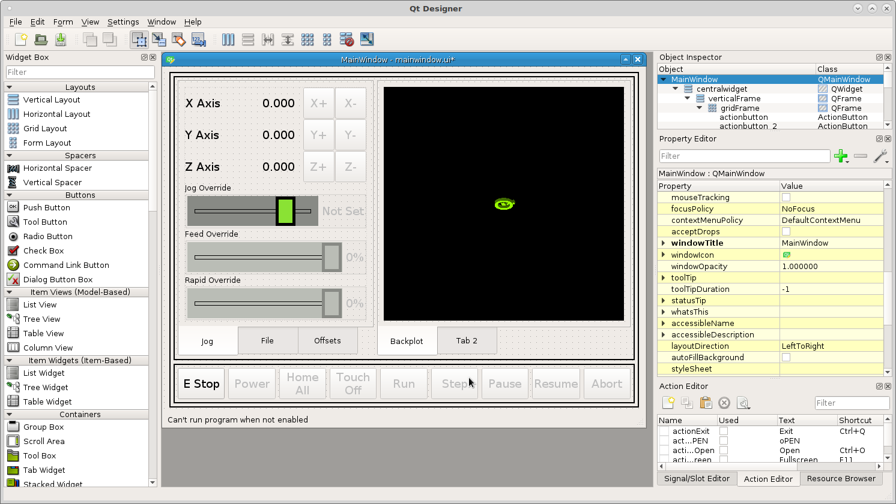
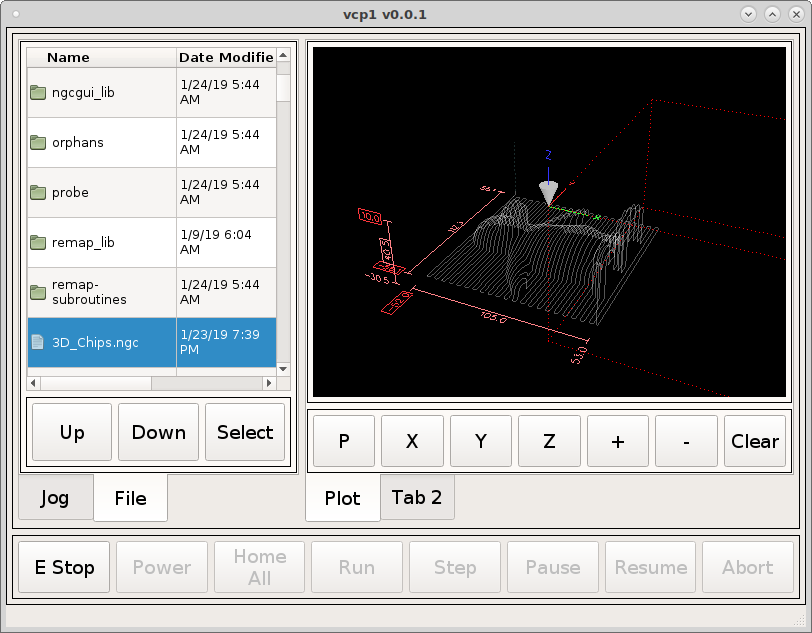
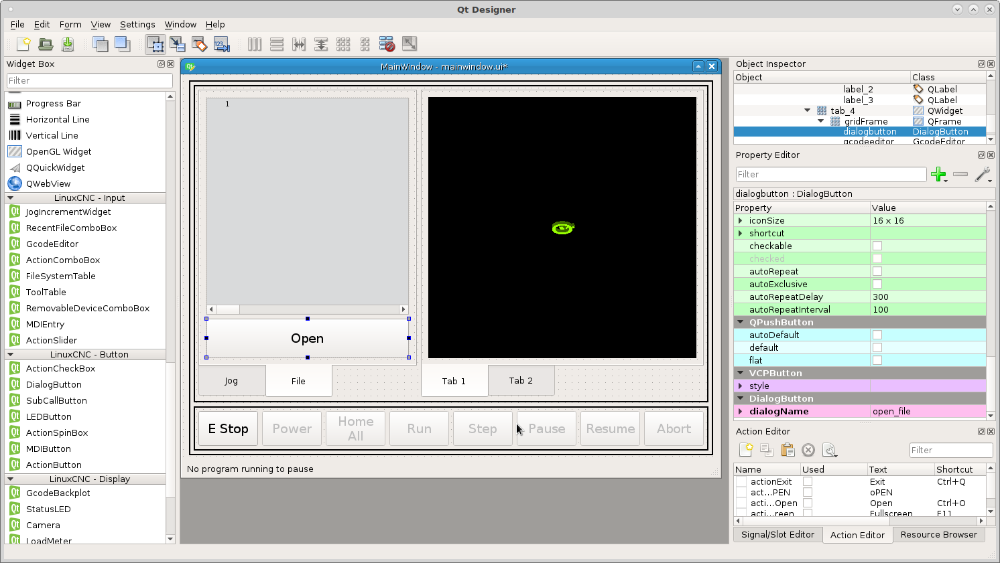

===================
DRO and File Dialog
===================

Add a `DROWidget` between the jog buttons and the axis labels and set the axis
and the reference_type to `Relative` for each one.

Now when we run the VCP we can see the DRO's change when we jog an axis.

In the second left tab widget do the same as before add a grid layout, right
click in the tab and select layout as a grid, right click the grid and morph
into qframe. in the frame stylesheet add the following::

    .DialogButton {
        min-height: 50px;
        min-width: 50px;
        font: 14pt "DejaVu Sans";
    }

Now add a `GcodeEditor` and a `DialogButton` and set the dialog button
`dialog_name` to ``open_file``. Remember to select the tabs you want to show
when the VCP is started then save the VCP.

Now when you run the VCP you can with a small object open a file.

.. image:: images/vcp1-run-11.png
   :align: center
   :scale: 60 %

Now add a `DialogButton` between the home button and the run button and set the
text to ``Touch\nOff`` and the `DialogName` to ``set_work_offsets``. In the
stylesheet for the buttons frame add the following::

    .DialogButton {
        min-height: 50px;
        min-width: 50px;
        font: 14pt "DejaVu Sans";
    }

.. image:: images/vcp1-designer-21.png
   :align: center
   :scale: 40 %

Add a rule to the dialog button enable with the channel ``status:enabled``
and the expression is ``ch[0]``. This will disable the touch off button until
power is applied.

.. image:: images/vcp1-designer-22.png
   :align: center
   :scale: 40 %

