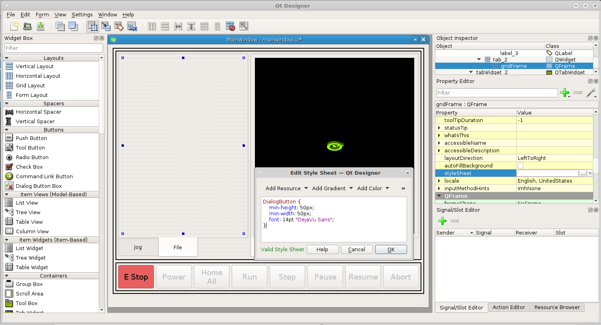
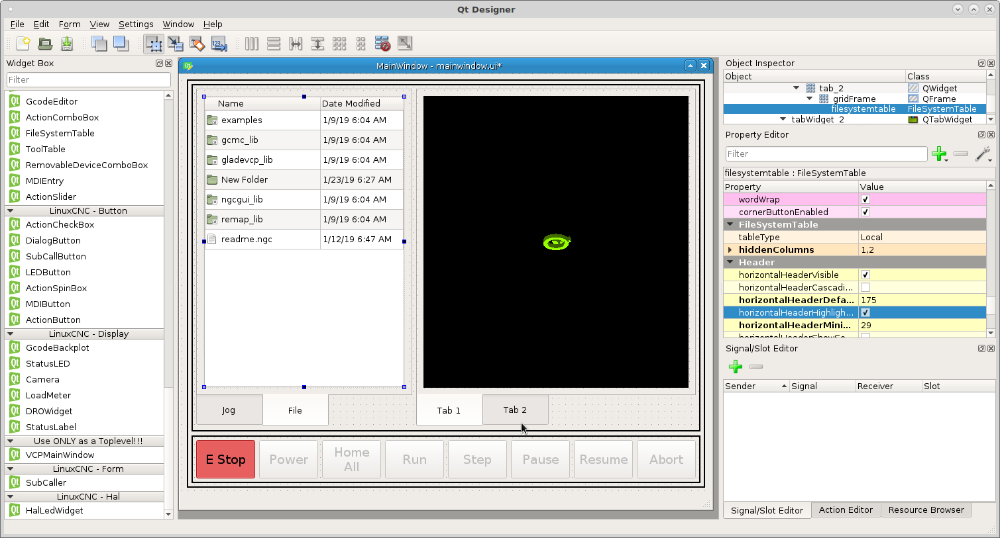
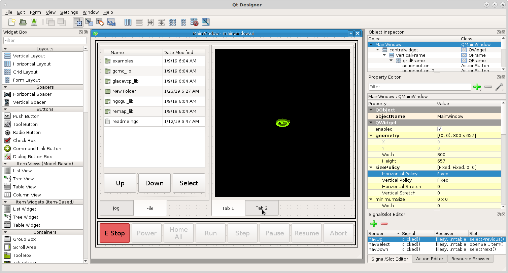
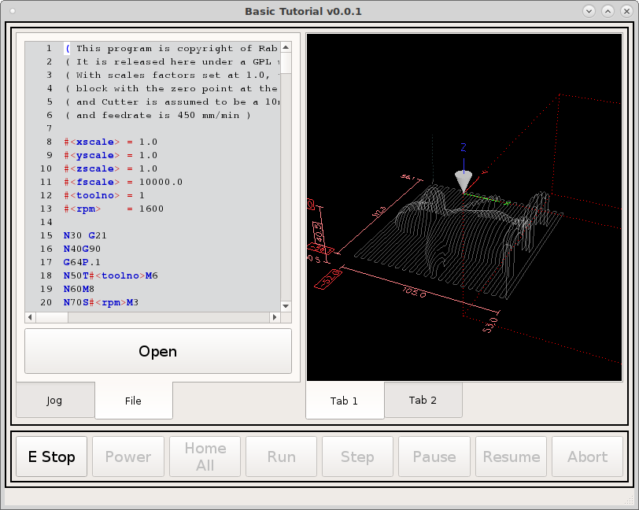
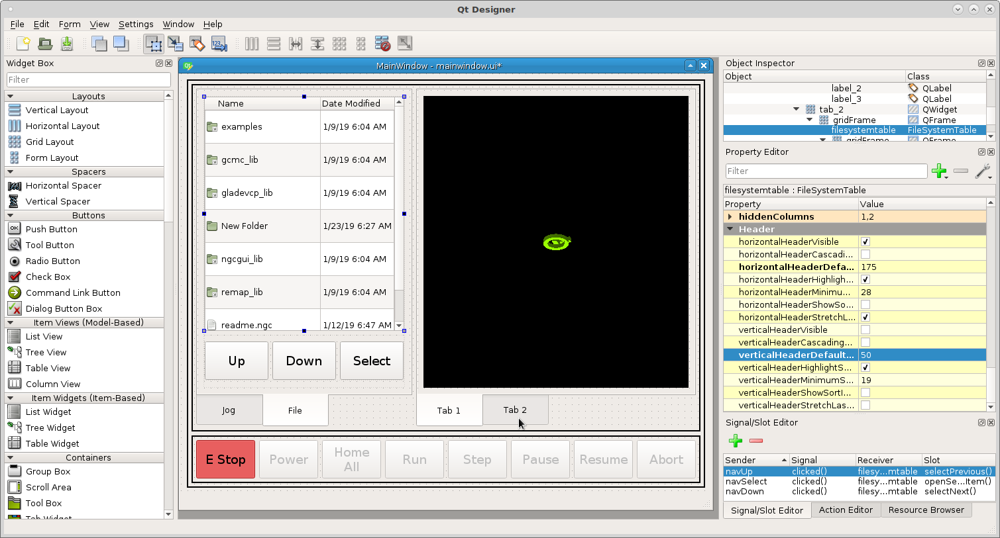

==============
File Navigator
==============

In Tab 2 of the left tab widget do the same as before add a grid layout, right
click in the tab and select layout as a grid, right click the grid and morph
into qframe. in the frame stylesheet add the following::

    DialogButton {
        min-height: 50px;
        min-width: 50px;
        font: 14pt "DejaVu Sans";
    }

Now add a `FileSystemTable` into the QFrame. In `hiddenColumns` add ``1,2`` to
hide the second and third column (numbers start at 0). Now change
`HorizontalDefaultSectionSize` to 175. This will make the left column a bit
wider.

Now add a grid under the file navigator and make sure its inside the frame and
morph it into a frame. Temporarily change the topMargin to 10 so you can drag
some `Push Buttons` from the `Buttons` Widget section (we don't need action
buttons for this. From left to right name them `Up, Down and Select`. Change the
`objectNames` to ``navUp`` ``navDown`` and ``navSelect``.

Select the `Signal/Slot` tab and add a new one with the green plus. Using the
drop down box for each item select as follows::

    Sender      Signal      Receiver            Slot
    navUp       clicked()   filesystemtable     selectPrevious()
    navDown     clicked()   filesystemtable     selectNext()
    navSelect   clicked()   filesystemtable     openSelectedItem()

Now when we run the VCP we can navigate up and down When you `Select` a
directory it opens the directory. When you `Select` a file it loads that file
into the VCP

If you change the `VerticalHeaderDefaultSectionSize` to 50 it will make the file
names large enough to just click on them with the touch screen.

