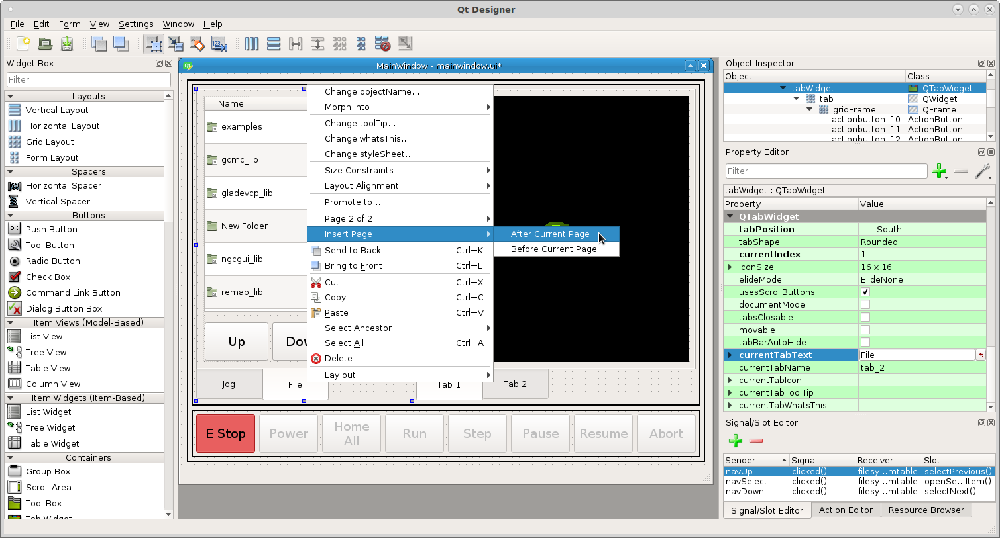
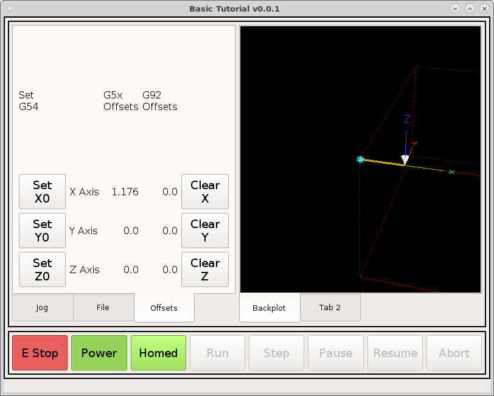

=======
Offsets
=======

Select the File tab on the left tab widget then right click on the File tab and
select `Insert Page After Current Page`

Change the `CurrentTabText` to Offsets. Add a grid layout then set the tab
layout to grid and morph the grid layout into a frame as before.

Now in the grid set the button size and label text size in the stylesheet::

    DialogButton {
        min-height: 50px;
        min-width: 50px;
        font: 14pt "DejaVu Sans";
    }
    ActionButton {
        min-height: 50px;
        min-width: 50px;
        font: 14pt "DejaVu Sans";
    }
    MDIButton {
        min-height: 50px;
        min-width: 50px;
        font: 14pt "DejaVu Sans";
    }
    StatusLabel {
        font: 12pt "DejaVu Sans";
    }
    QLabel {
        font: 12pt "DejaVu Sans";
    }

Add a DialogButton and set the dialogName to ``set_work_offsets``.

.. image:: images/vcp1-designer-26.png
   :align: center
   :scale: 40 %

Starting at the top add a regular label with the text ``Current\nSystem``. Then
to the right add a status label. Now create a new rule for the status label with
the channel ``status:g5x_index`` and the expression is
``["G53","G54","G55","G56","G57","G58","G59","G59.1","G59.2","G59.3"][ch[0]]``

This needs a bit of explaining, the g5x_index returns an integer that represents
the current coordinate system. The list of coordinate systems is in the same
order as the index so we use the return value from the ``status:g5x_index`` to
display only that item in the list by using what is called a slice. The syntax
is ["item 1","item 2","item 3"][index]. So if the index is 0 the first item in
the list is returned.

.. image:: images/vcp1-designer-27.png
   :align: center
   :scale: 40 %

Now add some labels and status labels like the following

.. image:: images/vcp1-designer-28.png
   :align: center
   :scale: 40 %

Change the label text like this and using the control key select all the status
labels and change the Horziontal Alignment to Align Right.

.. image:: images/vcp1-designer-29.png
   :align: center
   :scale: 40 %

Starting with the X Axis G5x Offset make a rule with this channel
``status:g5x_offset`` and this expression ``str(ch[0][0])`` and we are slicing
the tuple in the same way that we sliced the list. The axes are in this order
`X Y Z A B C U V W`. Repeat with the Y and Z incrementing the index number by 1.

.. image:: images/vcp1-designer-30.png
   :align: center
   :scale: 40 %

Now do the same thing for the G92 Offsets with the channel being
``status:g92_offset``

Now when we run we can see the offsets that are in effect.

.. image:: images/vcp1-run-12.png
   :align: center
   :scale: 60 %

The ``set_work_offsets`` dialog as you can see in this screen shot is designed
for a mouse so delete that and we will make some MDI buttons for the offsets tab.

.. image:: images/vcp1-run-13.png
   :align: center
   :scale: 60 %

Add three MDIButtons next to the Axis labels and put the following for the
`MDICommand`::

    G10L20P0X0
    G10L20P0Y0
    G10L20P0Z0

.. image:: images/vcp1-designer-31.png
   :align: center
   :scale: 40 %

Now when we run the VCP and jog around a bit we can set the coordinate system.

.. image:: images/vcp1-run-14.png
   :align: center
   :scale: 60 %

Now add three more MDIButtons to the right of the offsets and add the following
for the MDICommand::

    G10L2P0X0
    G10L2P0Y0
    G10L2P0Z0

.. image:: images/vcp1-designer-32.png
   :align: center
   :scale: 40 %

Now we can set and clear the current coordinate system offsets.

.. Note:: I changed the coordinate system status label rule expression to 
    ``"Set\n"+["G53","G54","G55","G56","G57","G58","G59","G59.1","G59.2","G59.3"][ch[0]]``
    and moved it over the Set MDI buttons.

