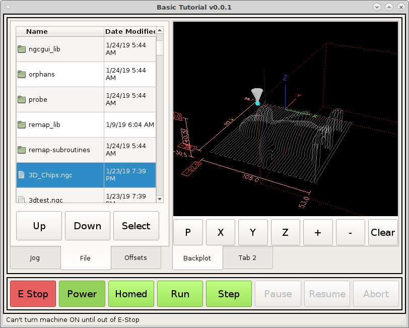

=========
Back Plot
=========

Lets finish the back plot tab by adding some normal push buttons to control the
view. Drag 7 buttons below the back plot and change the objectNames and text
like this::

    objectName  text
    xView       X
    yView       Y
    zView       Z
    viewZoomIn  +
    viewZoomOut -
    viewClear   Clear

In the grid that has the back plot and buttons in it add the following to the
stylesheet::

    QPushButton {
        min-height: 50px;
        min-width: 50px;
        font: 14pt "DejaVu Sans";
    }

.. image:: images/vcp1-designer-33.png
   :align: center
   :scale: 40 %

Now add 7 new signals with the following::

    Sender      Signal      Receiver        Slot
    pView       clicked()   gcodebackplot   setViewP()
    xView       clicked()   gcodebackplot   setViewX()
    yView       clicked()   gcodebackplot   setViewY()
    zView       clicked()   gcodebackplot   setViewZ()
    viewZoomOut clicked()   gcodebackplot   zoomOut()
    viewZoomIn  clicked()   gcodebackplot   zoomIn()
    viewClear   clicked()   gcodebackplot   clearLivePlot()

.. image:: images/vcp1-designer-34.png
   :align: center
   :scale: 100 %

Now when we run the VCP we can control the backplot with our touch buttons and
by dragging the touch screen.

