=======
Offsets
=======

Select Tab 2 from the right hand tab widget and add a grid, set the tab layout
to grid, morph the grid into a qframe and set the outline to box and the margins
to 5. Name the tab `Offsets`.

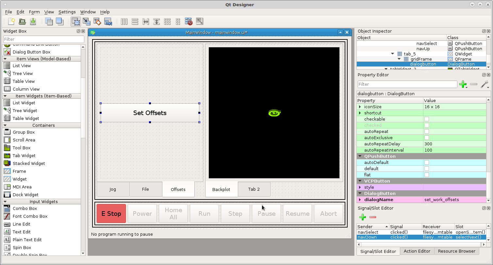

Drag some push buttons into the frame in a 4 x 4 pattern. Ctrl Left Click on
each button to select them all then Right Click on any button and select `Assign
to button group` `New button group`.

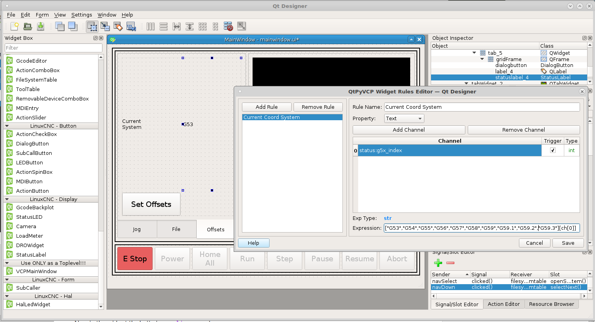

In the `Object Inspector` scroll down to the bottom and change the buttonGroup
objectName to ``offsetButtonGroup``. Now change the button text to match the
following. You can double click on each button to change the text.

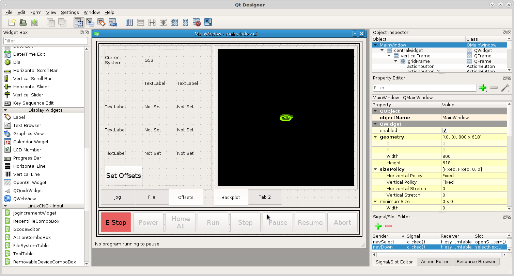

Right Click on the Clear button and select `Assign to button group` `None` to
remove it from the button group. Change the objectName to ``clearOffsetLabel``

Add 3 `MDIButtons` and a `Label` below the buttons and add a box frameShape to
the label and delete the text. Change the label objectName to ``offsetLabel``.
Change the Horizontal alignment to Align Right.

Set the text for each button to the following remebering that ``\n`` means new
line.
::

    Set\nX
    Set\nY
    Set\nZ

Now add a new Signal/Slot and sender = clearOffsetLabel, signal = clicked(),
receiver = offsetLabel, slot = clear().

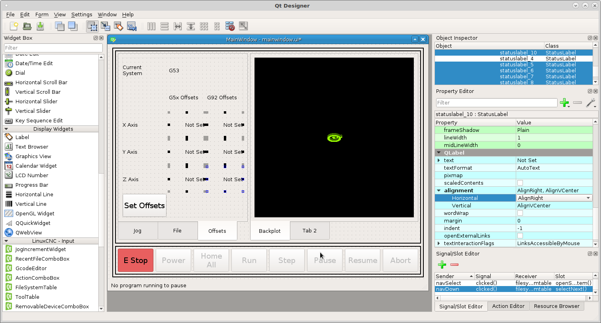

Now open back up `~vcp1/vcp1/mainwindow.py` and add the following
::

                self.offsetButtonGroup.buttonClicked.connect(self.offsetHandleKeys)

            def offsetHandleKeys(self, button):
                char = str(button.text())
                text = self.offsetLabel.text() or '0'
                if text != '0':
                    text += char
                else:
                    text = char
                self.offsetLabel.setText(text)

The full mainwindow.py code.
::

    from qtpyvcp.widgets.form_widgets.main_window import VCPMainWindow

    # Setup logging
    from qtpyvcp.utilities import logger
    LOG = logger.getLogger('qtpyvcp.' + __name__)

    class MyMainWindow(VCPMainWindow):
        """Main window class for the VCP."""
        def __init__(self, *args, **kwargs):
            super(MyMainWindow, self).__init__(*args, **kwargs)
            self.mdiButtonGroup.buttonClicked.connect(self.mdiHandleKeys)
            self.offsetButtonGroup.buttonClicked.connect(self.offsetHandleKeys)

        # add any custom methods here

        def mdiHandleKeys(self, button):
            char = str(button.text())
            text = self.mdiEntry.text() or '0'
            if text != '0':
                text += char
            else:
                text = char
            self.mdiEntry.setText(text)

        def offsetHandleKeys(self, button):
            char = str(button.text())
            text = self.offsetLabel.text() or '0'
            if text != '0':
                text += char
            else:
                text = char
            self.offsetLabel.setText(text)

Now when we run the VCP we can enter numbers into the label and clear the label.

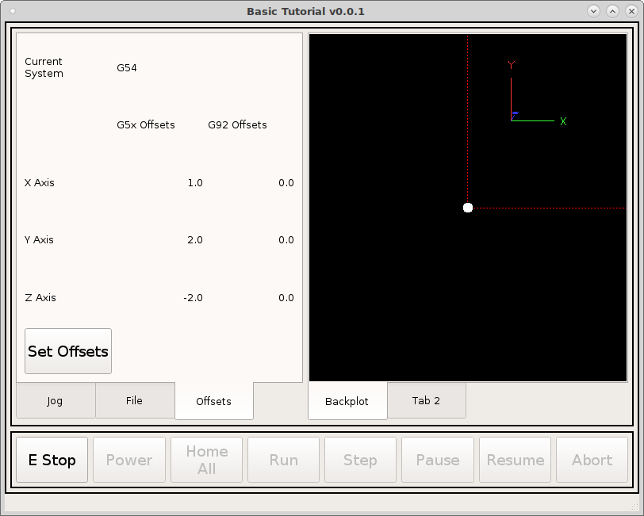

Now in the frame that has the buttons open the style sheet and add the following
to change the font size of labels and status labels.
::

    QLabel {font: 12pt "DejaVu Sans";}
    StatusLabel {font: 12pt "DejaVu Sans";}

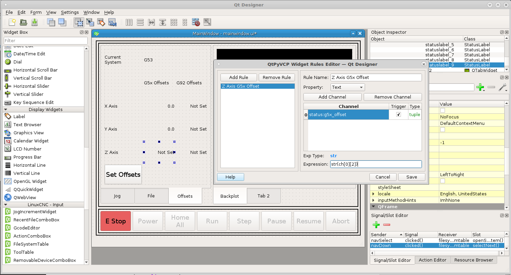

Now add some `Labels` and `StatusLabels` and set the horizontal alignment like
the following and change the text of the labels.

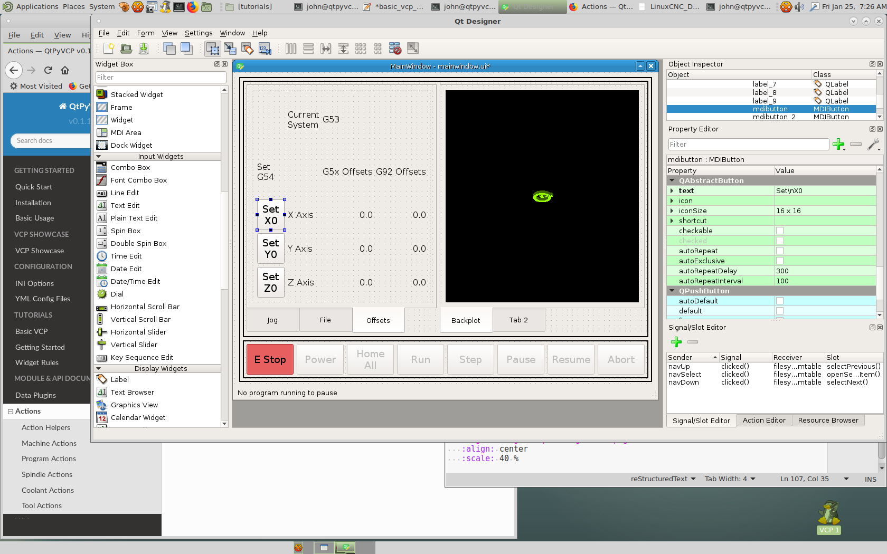

Now lets add the rules for the status labels The top row for the G5x Offsets is
the following. The `status:g5x_offset` returns a tuple so to get the offset for
an axis we have to only get one slice of the tuple. In the expression we slice
the tuple with the `[0]` at end of `ch[0]`. The Axes in the tuple are X, Y, Z,
A, B, C, U, V and W.
::

    status label    channel             expression
    X Axis          status:g5x_offset   str(ch[0][0])
    Y Axis          status:g5x_offset   str(ch[0][1])
    Y Axis          status:g5x_offset   str(ch[0][2])

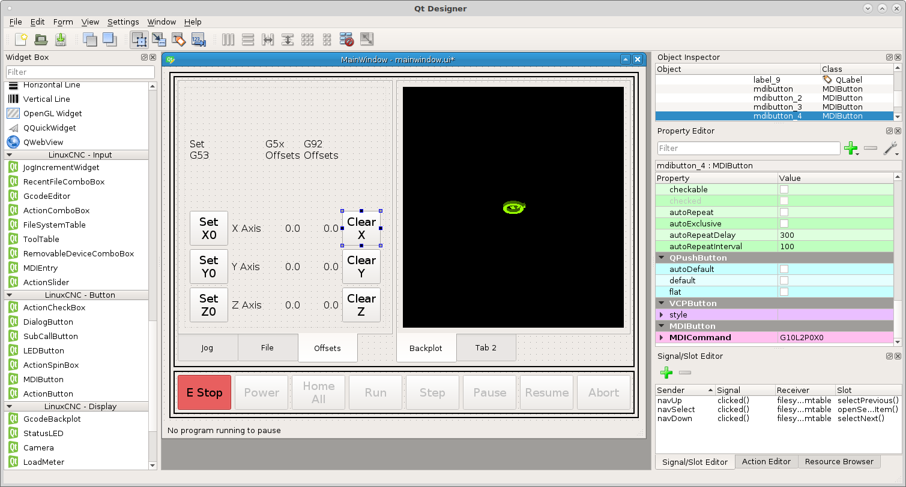

Now add the rules for the G92 offsets
::

    status label    channel             expression
    X Axis          status:g92_offset   str(ch[0][0])
    Y Axis          status:g92_offset   str(ch[0][1])
    Y Axis          status:g92_offset   str(ch[0][2])

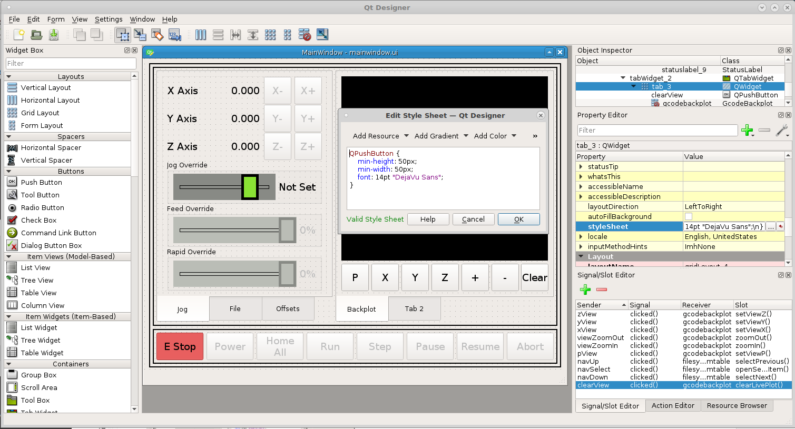

Now when we run the VCP if there are any offsets in effect we can see them on
the Offsets tab.

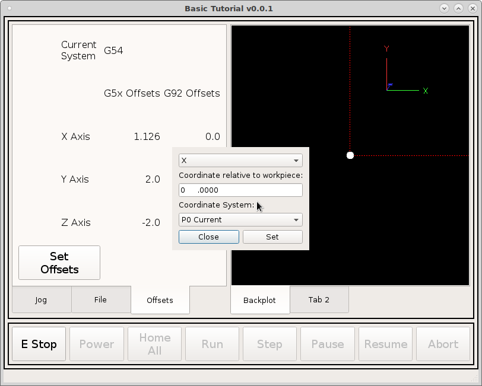

Now this is where the rubber meets the road and the power of QtPyVCP shines. Set
the `MDICommands` for each button starting with the Set X button.
::

    G10L20P0X#<offsetLabel>
    G10L20YP0#<offsetLabel>
    G10L20ZP0#<offsetLabel>

The magic is `#<offsetLabel>` which inserts the text from that label into the G
code. This is how you can use the label contents in a MDI command.

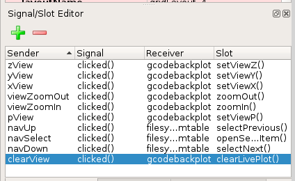

Now when we run we can set or remove offsets.

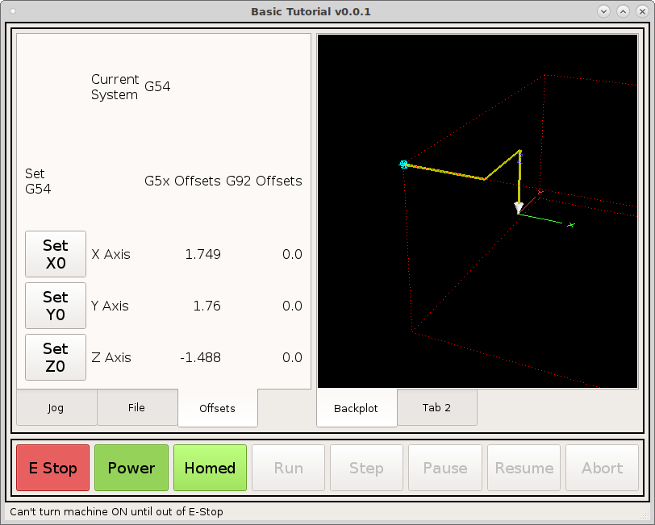

