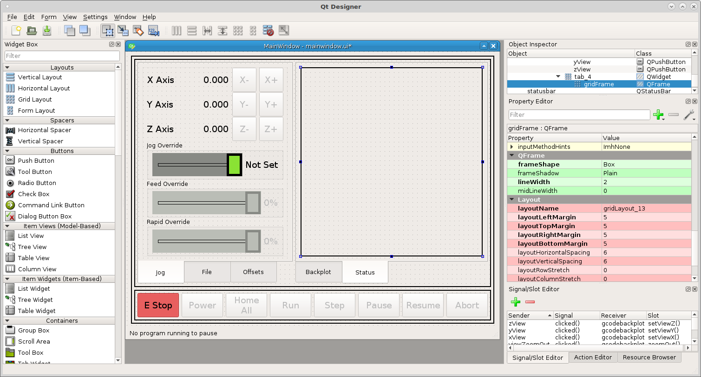
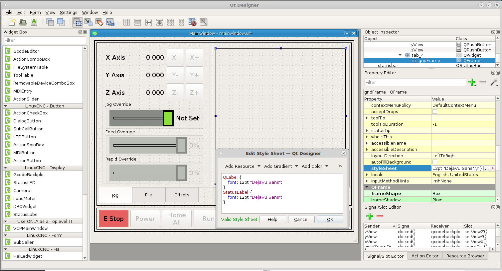
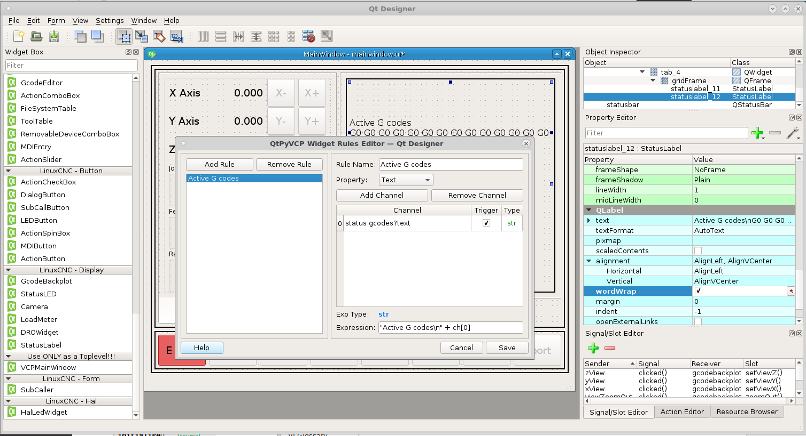
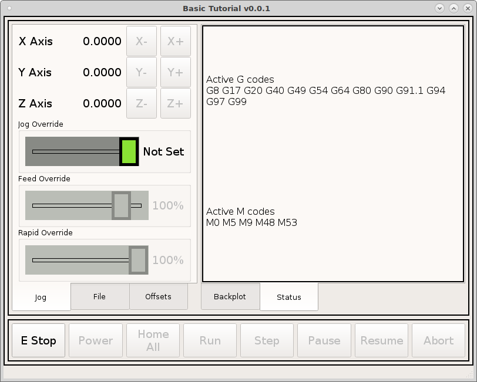
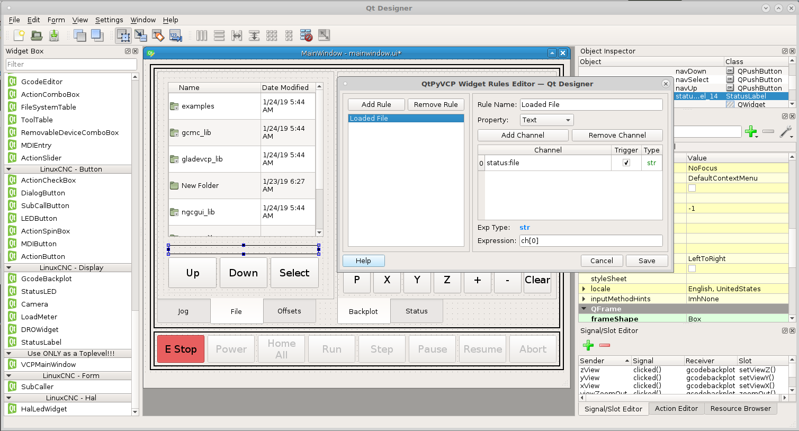
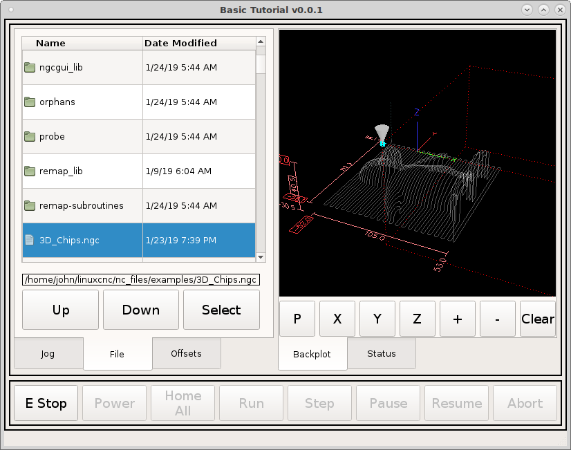

==============
Status Display
==============

Go to the right hand tab widget and drag a grid layout like before and right
click in the tab not the grid and select layout as a grid. Right click in the
grid and morph to a Qframe and set the outline as box, width 2 and margins 5 so
we can drag objects in easier. The box and extra margins can be removed once you
have finished locating your objects.

Now we want the status labels and the labels to all be the same size font so in
the frame add this to the stylesheet::

    QLabel {
        font: 12pt "DejaVu Sans";
    }
    StatusLabel {
        font: 12pt "DejaVu Sans";
    }

In the :doc:`../plugins/status` page in the `Status Class` you can see a list of
all the status items.

Drag a Status label into the frame and set the channel to ``status:gcodes?text``
this will return the active G codes. The equation is 
``"Active G codes\n" + ch[0]``. Check word wrap for this one.

Add another status label and add the M codes in the same manner, channel
``status:mcodes?text``, equation is ``"Active M codes\n" + ch[0]``

Now when we run the VCP we can see the active G and M codes.

On the File tab add a status label between the buttons and the file navigator
and stretch it to be full width. Double click on the status label and add a new
rule. The channel is ``status:file`` and the expression is ``ch[0]``. Notice
that the channel type is str and the expression type is str so we don't need to
convert it.

Now when we run the VCP and load a file we can see what file is loaded.

