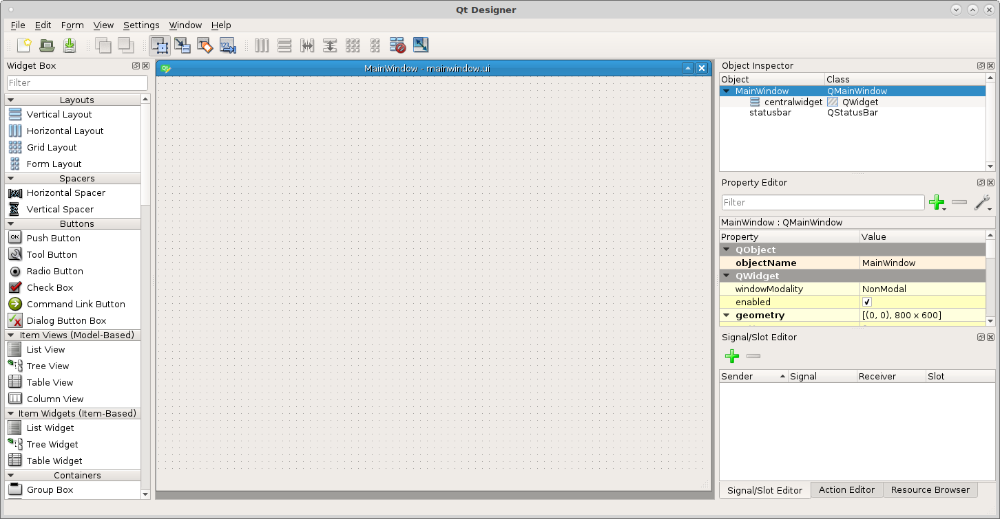
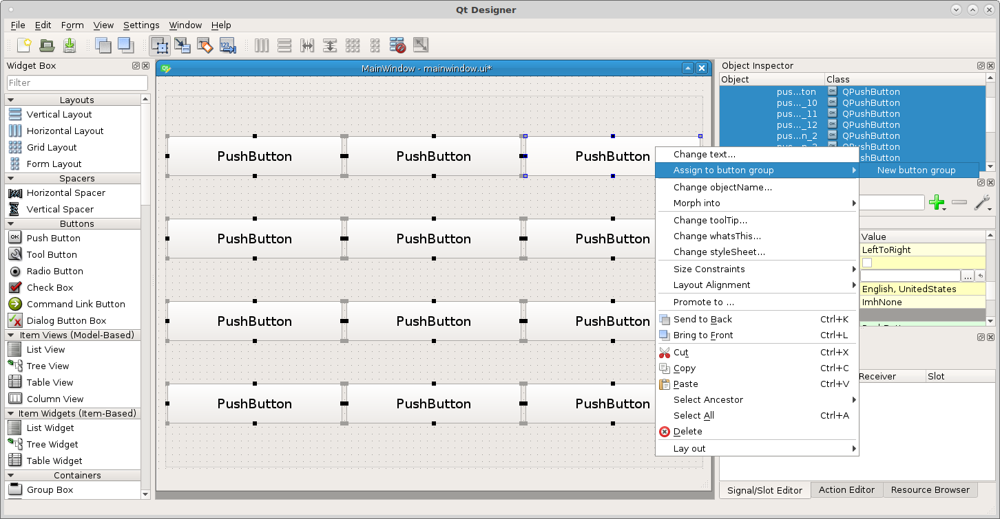
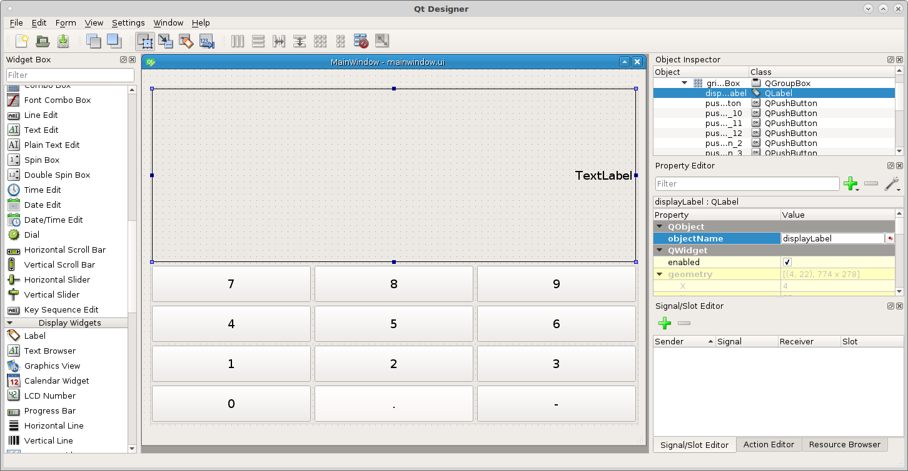
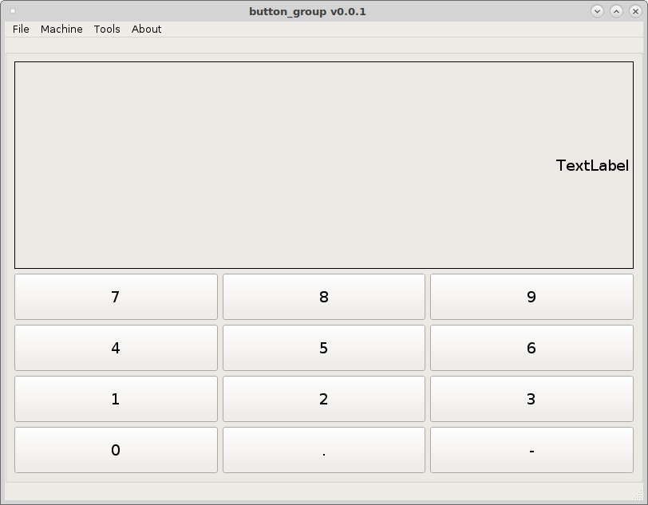

=============
Button Groups
=============

A Button Group is a very powerful and flexible way to have a touch screen
keyboard. You add push buttons to the panel then select them all and add them to
a button group. The button group will emit a signal any time a button is
pressed.

Once you `connect` the button group to a function when a button is pressed it
sends the button pressed to the function so every property is available to use.
Then you can use the properties of the button like `button.text()` to get the
text of the button.

For this tutorial I'll clone a copy of the vcp template as shown in the :doc:`vcp_template` page and name the VCP ``button_group`` and copy the
LinuxCNC Configuration Files so we can test the VCP as we go along.

Now open a terminal and edit the vcp with ``editvcp`` and select
`~button_group/button_group/config.yml`.

.. image:: images/btn-grp-designer-01.png
   :align: center
   :scale: 80 %

Now we have the blank template to work with.

Lets start by adding some buttons to create a number keypad. First drag a `Grid
Layout` into the main window and right click on it and morph it into a `Group
Box`. Next drag some buttons into the group box like so.

.. image:: images/btn-grp-designer-03.png
   :align: center
   :scale: 40 %

This is a touch screen example so lets make the buttons big enough to touch. In
the Main Window open the `stylesheet` and add the following style to set the
minimum height and width and set the font size.
::

    QPushButton {
    min-height: 50px;
    min-width: 50px;
    font: 14pt "DejaVu Sans";
    }

.. image:: images/btn-grp-designer-04.png
   :align: center
   :scale: 40 %

Now we can see the buttons are large enough to use with a touch screen.

.. image:: images/btn-grp-designer-05.png
   :align: center
   :scale: 40 %

Next we need to add the buttons into a group Ctrl left click on each button to
select it then right click on any button and select `Assign to button group`
`New button group`

Change the objectName of the button group to ``numberGroup`` and change the text
of the buttons like this.

.. image:: images/btn-grp-designer-07.png
   :align: center
   :scale: 40 %

Now add a label and stretch it so it spans the width of the group box and change
the objectName to ``displayLabel``. I added a box to the label and changed the
font to alignRight and the font size to 14.

If you run the button group you can see the buttons but they won't do anything.
Open `~button_group/button_group/mainwindow.py` and you will see the following.
::

    from qtpyvcp.widgets.form_widgets.main_window import VCPMainWindow

    # Setup logging
    from qtpyvcp.utilities import logger
    LOG = logger.getLogger('qtpyvcp.' + __name__)

    class MyMainWindow(VCPMainWindow):
        """Main window class for the VCP."""
        def __init__(self, *args, **kwargs):
            super(MyMainWindow, self).__init__(*args, **kwargs)

        # add any custom methods here

Indentation in Python is strict so use spaces in this file so they remain the
same. In the `__init__` function we need to connect the button group to a
function. We do this with a `connect` function. We connect the buttonClicked
that is passed by the button group to the function.

The syntax is:
::

    self.buttonGroupName.buttonClicked.connect(self.functionName)

So add the following to mainwindow.py in the `__init__` function.
::

    self.numberGroup.buttonClicked.connect(self.numberKeys)

We also need to create the function `numberKeys` and for now it will do nothing.
::

    def numberKeys(self, button):
        pass

The file will look like this now.
::

    from qtpyvcp.widgets.form_widgets.main_window import VCPMainWindow

    # Setup logging
    from qtpyvcp.utilities import logger
    LOG = logger.getLogger('qtpyvcp.' + __name__)

    class MyMainWindow(VCPMainWindow):
        """Main window class for the VCP."""
        def __init__(self, *args, **kwargs):
            super(MyMainWindow, self).__init__(*args, **kwargs)
            self.numberGroup.buttonClicked.connect(self.numberKeys)

        # add any custom methods here

        def numberKeys(self, button):
            pass

You can test run and it should load without any errors, if you get an error
check for typo's or an indentation problem.

Delete the text from the displayLabel so it's blank and add to the numberKeys
function the following code.
::

        def numberKeys(self, button):
            text = self.displayLabel.text() # copy the label text to the variable
            if len(text) > 0: # if there is something in the label
                text += button.text() # add the button text to the text variable
            else: # if the label is empty
                text = button.text() # assign the button text to the text variable
            self.displayLabel.setText(text) # set the text in label

Now when we run the VCP we can add the text from each button to the label.

.. image:: images/btn-grp-run-02.png
   :align: center
   :scale: 60 %

Now for some correction keys add a couple of push buttons below the numbers and
name one ``Backspace`` and the other one ``Clear`` and change the objectNames to
``backspaceButton`` and ``clearButton``.

We will do the easy one first, add a new signal/slot and set it up like this:
::

    Sender     clearButton
    Signal     clicked()
    Receiver   displayLabel
    Slot       Clear()

.. image:: images/btn-grp-designer-09.png
   :align: center
   :scale: 40 %

Now you can clear the entry so lets do the backspace button. Open up
mainwindow.py and add a new connection. Notice that the button emits a `clicked`
signal not a `buttonClicked`.
::

            self.backspaceButton.clicked.connect(self.numberKeyBackspace)

Create the function and notice the `[:-1]` which removes the last character from
the text.
::

        def numberKeyBackspace(self):
            text = self.displayLabel.text()[:-1] # assign all but the last char to text
            self.displayLabel.setText(text)

And the mainwindow.py file looks like this now.
::

    from qtpyvcp.widgets.form_widgets.main_window import VCPMainWindow

    # Setup logging
    from qtpyvcp.utilities import logger
    LOG = logger.getLogger('qtpyvcp.' + __name__)

    class MyMainWindow(VCPMainWindow):
        """Main window class for the VCP."""
        def __init__(self, *args, **kwargs):
            super(MyMainWindow, self).__init__(*args, **kwargs)
            self.numberGroup.buttonClicked.connect(self.numberKeys)
            self.backspaceButton.clicked.connect(self.numberKeyBackspace)

        # add any custom methods here

        def numberKeys(self, button):
            text = self.displayLabel.text() # copy the label text to the variable
            if len(text) > 0: # if there is something in the label
                text += button.text() # add the button text to the text variable
            else: # if the label is empty
                text = button.text() # assign the button text to the text variable
            self.displayLabel.setText(text) # set the text in label

        def numberKeyBackspace(self):
            text = self.displayLabel.text()[:-1] # assign all but the last char to text
            self.displayLabel.setText(text)

Now when you run the VCP you can put numbers in the label and remove or clear
them. If the label was a mdiEntry we could issue the MDI command with a signal
slot connection like the Clear() was used on the label.

**Properties**

If you need to send something longer like a preamble or a rapid to home G code
to a mdiEntry having a button like `G53 G0 X0 Y0 Z0` might take up too much
space so for that we will use a `Dynamic Property` to our buttons.

Drag a Grid Layout below the number key group box and morph into a group box.
Add a `mdiEntry` and a couple of buttons. Name them ``Preamble`` and
``Rapid\nHome``. Select them and add them to a new button group and name the
button group ``mdiGroup``.

Open up the mainwindow.py file and add a connection for the mdiGroup to the
``mdiKeys`` function.
::

             self.mdiGroup.buttonClicked.connect(self.mdiKeys)

Create the mdiKeys funtion with a pass for now.
::

        def mdiKeys(self, button):
            pass

Lets start with the Preamble button and add two Dynamic Properties by clicking
on the green plus sign in the Property Editor and selecting `String`. Put
``gcode`` as the `Property Name`. Add a second one as string with the property
name of ``action``.

.. image:: images/btn-grp-designer-10.png
   :align: center
   :scale: 40 %

In the gcode dynamic property of the Preamble button put
``G20 G17 G40 G49 G64 P0.005 G80 G90 G92.1 G94`` and in the action dynamic
property put ``replace``.

In the gcode dynamic property of the Rapid Home button put ``G53 G0 X0 Y0 Z0``
and in the action dynamic property put ``replace``.

.. image:: images/btn-grp-designer-11.png
   :align: center
   :scale: 40 %

Now add the code for a button action of `replace` to the mdiKeys function
::

            if (button.property('action')) == 'replace':
                self.mdiEntry.setText(button.property('gcode'))

So now the mainwindow.py file should look like this
::

    from qtpyvcp.widgets.form_widgets.main_window import VCPMainWindow

    # Setup logging
    from qtpyvcp.utilities import logger
    LOG = logger.getLogger('qtpyvcp.' + __name__)

    class MyMainWindow(VCPMainWindow):
        """Main window class for the VCP."""
        def __init__(self, *args, **kwargs):
            super(MyMainWindow, self).__init__(*args, **kwargs)
            self.numberGroup.buttonClicked.connect(self.numberKeys)
            self.backspaceButton.clicked.connect(self.numberKeyBackspace)
            self.mdiGroup.buttonClicked.connect(self.mdiKeys)

        # add any custom methods here

        def numberKeys(self, button):
            text = self.displayLabel.text() # copy the label text to the variable
            if len(text) > 0: # if there is something in the label
                text += button.text() # add the button text to the text variable
            else: # if the label is empty
                text = button.text() # assign the button text to the text variable
            self.displayLabel.setText(text) # set the text in label

        def numberKeyBackspace(self):
            text = self.displayLabel.text()[:-1] # assign all but the last char to text
            self.displayLabel.setText(text)

        def mdiKeys(self, button):
            if (button.property('action')) == 'replace':
                self.mdiEntry.setText(button.property('gcode'))

Now when we run the VCP and click on the two buttons you can see how the text in
the gcode dynamic property is placed into the mdiEntry.

.. image:: images/btn-grp-run-03.png
   :align: center
   :scale: 60 %

To show how the action Dynamic Property can work lets add some more buttons.
Select them all and add two Dynamic Properties like before but to all of them at
once.

.. image:: images/btn-grp-designer-12.png
   :align: center
   :scale: 40 %

With all 4 buttons still selected add ``append`` to the action dynamic property
and right click on one button and assign them to the mdiGroup. Now select each
button one at a time and add the following to the gcode dynamic property.
::

    Rapid G53       G53 G0
    X0              X0
    Y0              Y0
    Z0              Z0

Now add the following to the mdiKeys function in the mainwindow.py file.
::

            if (button.property('action')) == 'append':
                text = self.mdiEntry.text()
                text += button.property('gcode')
                self.mdiEntry.setText(text)

Now add a Clear button and add a signal linking it to the mdiEntry Clear().

.. image:: images/btn-grp-designer-13.png
   :align: center
   :scale: 40 %

When we run the example we can see the gcode added to or replaced in the MDI
entry. If we had a fully running example a Send button connected to the mdiEntry
submit() slot would send the G code to LinuxCNC.

.. image:: images/btn-grp-run-04.png
   :align: center
   :scale: 60 %

