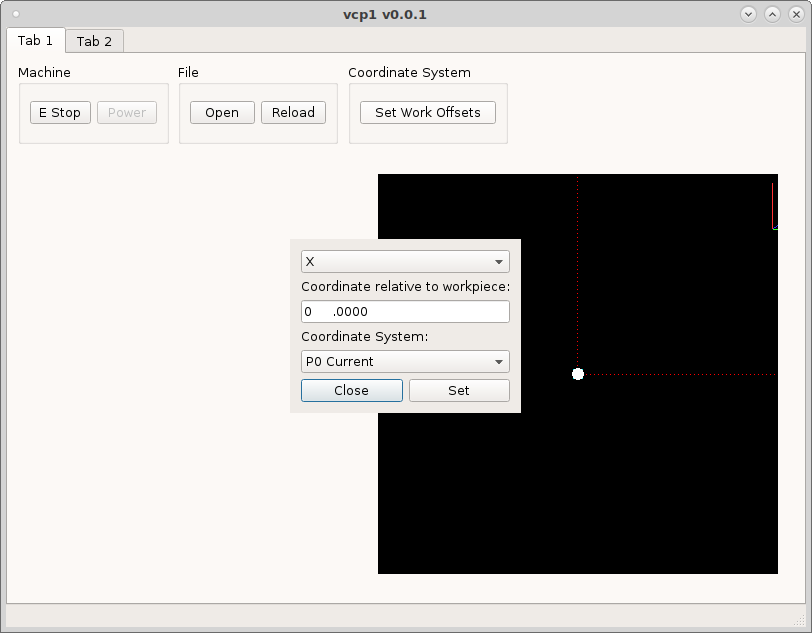
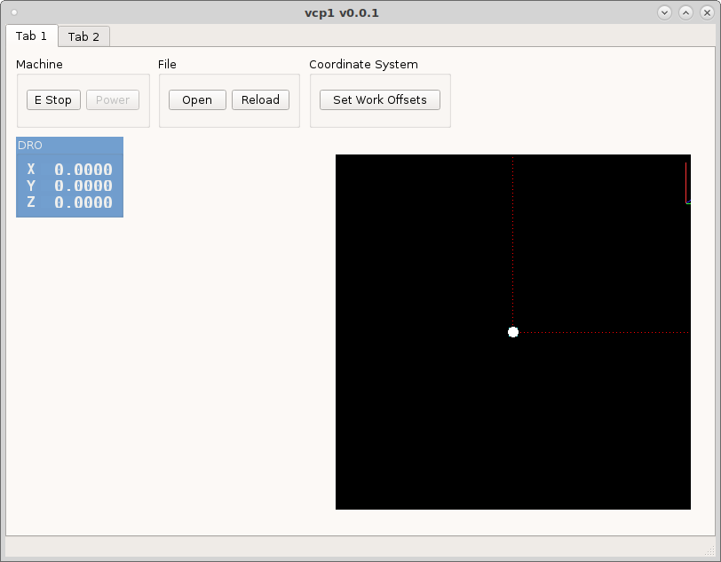
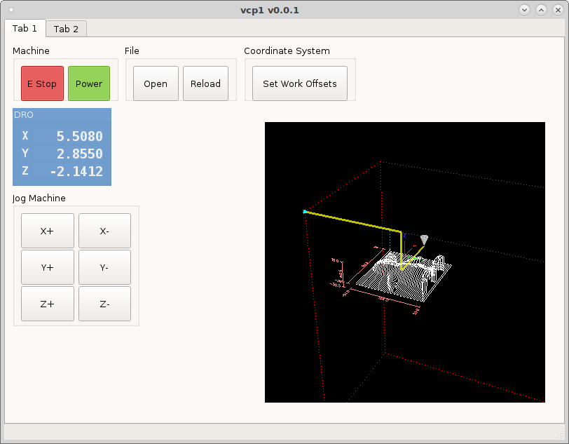

=======
Dialogs
=======

Dialogs are small popup windows that perform different functions.
They are a good way to get input from a user, or display information
that might take up too much room on the main screen.

Standard Dialogs
----------------

To launch a dialog add a `DialogButton` to the vcp and in the `dialogName`
add the name of the dialog.

Lets add an Open dialog to the vcp by adding a `DialogButton` to a group box and
in the `dialogName` put ``open_file``. Change the minimum width and height to 50
and save and run.

If we add a `GcodeBackplot` widget to the vcp we can see the file that is loaded.

Now we need to add the touch off dialog by adding a `DialogButton` and setting
the `dialogName to ``set_work_offsets``.

Available Standard Dialogs:

* set_work_offsets
* open_file

Custom Dialogs
--------------

Custom dialogs can be defined by either a .ui file or a .py file.

**Dialogs from UI file:**

To make a custom dialog, create a new dialog in QtDesigner. Make sure
to use one of the dialog templates when creating the new form.

Now in the .yml config file add your dialog to the `dialogs` section.

.. code-block:: yaml

    dialogs:
      my_dialog:
        provider: qtpyvcp.widgets.dialogs.base_dialog:BaseDialog
        kwargs:
          ui_file: {{ file.dir }}/my_dialog.ui
          title: My Dialog Title    # optional, set the dialog title
          modal: false              # optional, whether the dialog is modal
          popup: false              # optional, whether the dialog is a popup
          frameless: false          # optional, whether the dialog is frameless
          stay_on_top: true         # optional, whether the dialog stays on top

**Dialogs from Python:**

If your dialog is complicated enough to require python code, you can
inherit the :doc:`BaseDialog </widgets/dialogs/index>` and create
your own dialog provider class.

Create a new file named `my_dialog.py` with the content:

.. code-block:: python

    from qtpyvcp.widgets.dialogs.base_dialog import BaseDialog

    class MyDialog(BaseDialog):
        def __init__(self, *args, **kwargs):
            super(MyDialog, self).__init__(*args, **kwargs)

        # implement dialog functionality here

And in your .yml config file specify the custom provider:

.. code-block:: yaml

    my_dialog:
      provider: my_vcp.my_dialog:MyDialog

This custom provider will accept all the same kwarg options as the
:doc:`BaseDialog </widgets/dialogs/index>`, but will allow you
to use python code to add more advanced functionality than you could
with .ui file dialog.
