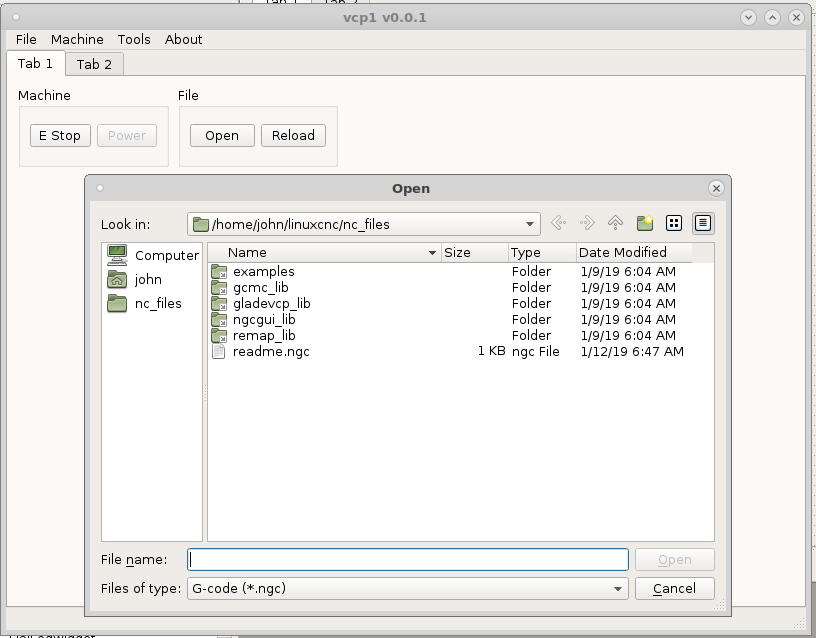
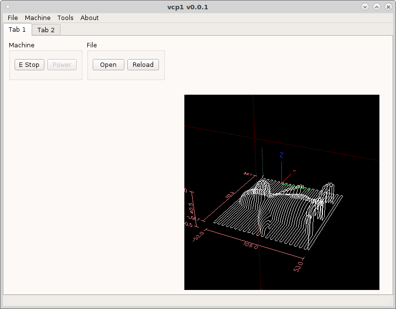

=======
Dialogs
=======

Dialogs open up popup windows that perform different functions. To launch a
dialog add a `DialogButton` to the vcp and in the `dialogName` add the name of
the dialog.

Lets add an Open dialog to the vcp by adding a `DialogButton` and in the
`dialogName` put `open_file`.

If we add a `GcodeBackplot` widget to the vcp we can see the file that is loaded.

Now we need to add the touch off dialog by adding a `DialogButton` and setting
the `dialogName to `set_work_offsets`.

.. image:: images/vcp1run-06.png
   :align: center
   :scale: 75 %

Current Dialogs

* set_work_offsets
* open_file

