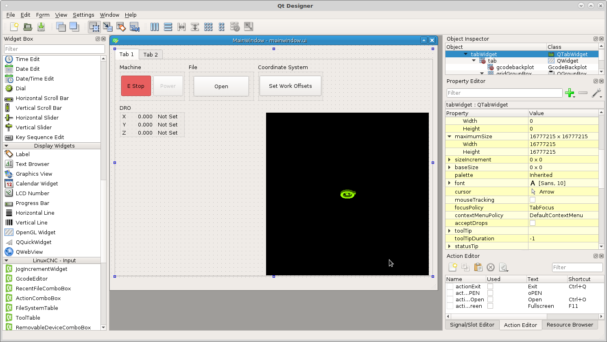
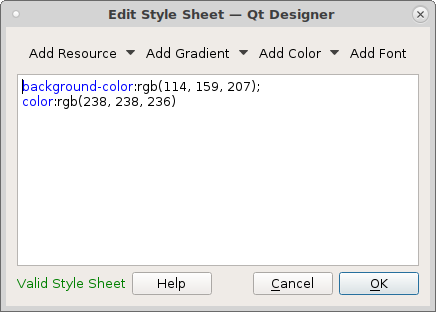
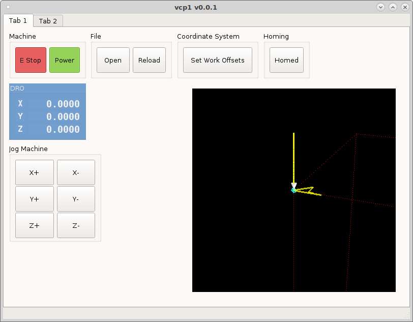
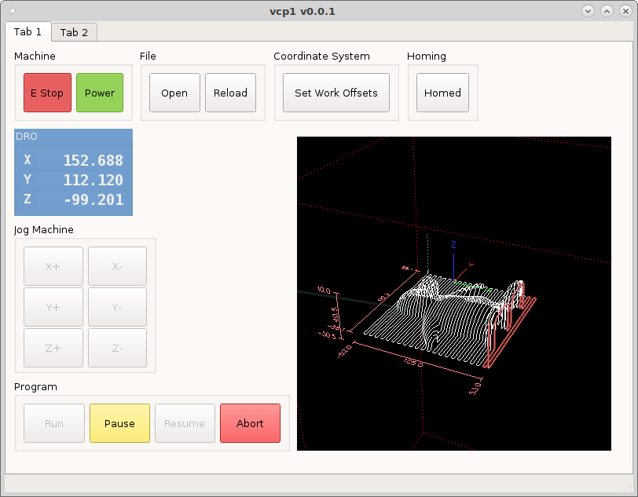

============
DRO Tutorial
============

To add a DRO to your VCP drag three `DROWidgets` from the `LinuxCNC Display`
section into a group box. Place three `StatusLabels` to the right side of the
`DROWidgets` and three `Labels` on the left side. Change the maximumSize Width
to 15 for the three labels and change the alignment to center and name them
X, Y and Z.

In the `Property Editor` scroll down to the `DROWidget` section. Here you can
set the DRO properties for each `DROWidget`.

.. image:: images/dro-properties.png
   :align: center
   :scale: 80 %

* `reference_type` Absolute, Distance to Go or Relative
* `axis` select the axis to track
* `units` select from fixed units of Inch or Metric or currently running \
  Program units
* `diameter_mode` is for a lathe
* `metric_template` allows you to set the number format for metric units
* `imperial_template` allows you to set the number format for inch units
* `number format` %3.2f will display as `123.40`

In the `QWidget` section you can modify the font, size and colors of the DRO
group box.

To change the colors click on the ellipse in `styleSheet` to open the 
`Edit Style Sheet` dialog. To change the background color click on the down
arrow to the right of `Color` and select `background-color` then click on the
color you want. To add a second item pick the item from the color dropdown then
pick the color.

Now when we run the vcp we can see the DRO.

Next edit the `statusLabel` for each DRO to show if the axis is homed or not.
Double click to open the `rules editor` and add a rule and a channel. The
channel is ``status:joint[0].homed`` for the X axis and the expression is
``'Homed' if ch[0] else 'Not Homed'``.

.. image:: images/dro-rule-01.png
   :align: center
   :scale: 100 %

Repeat for the remaining axes with ``status:joint[1].homed`` for Y and
``status:joint[2].homed`` for Z. The expression is the same for all the axes.
Now save and run the VCP.

Next we will change the color of the text when homed and not homed. Double click
on the status label for X axis and add a new rule and select `Style Sheet` then
add a channel ``status:joint[0].homed`` and add the expression
``"color:rgb(115, 210, 22)" if ch[0] else "color:rgb(204, 0, 0)"``. Which reads
set the color of the text to green if ch[0] is true else set the color to red.
Remember to use a label stylesheet to get the correct syntax and color.

.. image:: images/dro-rule-02.png
   :align: center
   :scale: 100 %

Now we can see the status label text is red because we have not homed yet.

.. image:: images/vcp1run-11.png
   :align: center
   :scale: 75 %

