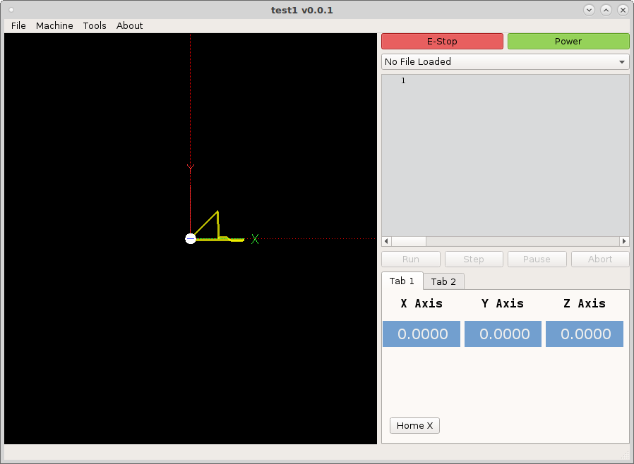

============
DRO Tutorial
============

To add a DRO to your VCP drag the `DROWidget` from the `LinuxCNC Display`
section onto your VCP. In the `Property Editor` scroll down to the `DROWidget`
section. Here you can set the DRO properties.

.. image:: images/dro-properties.png
   :align: center
   :scale: 80 %

* `reference_type` Absolute, Distance to Go or Relative
* `axis` select the axis to track
* `units` select from fixed units of Inch or Metric or currently running \
  Program units
* `diameter_mode` is for a lathe
* `metric_template` allows you to set the number format for metric units
* `imperial_template` allows you to set the number format for inch units
* `number format` %3.2f will display as `123.40`

In the `QWidget` section you can modify the font, size and colors of the DRO.

To change the colors click on the ellipse in `styleSheet` to open the 
`Edit Style Sheet` dialog. To change the background color type in 
``background-color:`` and double click on `Add Color` then click on the color
you want. To add a second item append a semi-colon to the end of the line then
start a new line with the second style.

.. image:: images/edit-style-sheet.png
   :align: center
   :scale: 100 %

I added a `Grid Layout` to the tab and dragged the labels and dro widgets into
the grid layout.

