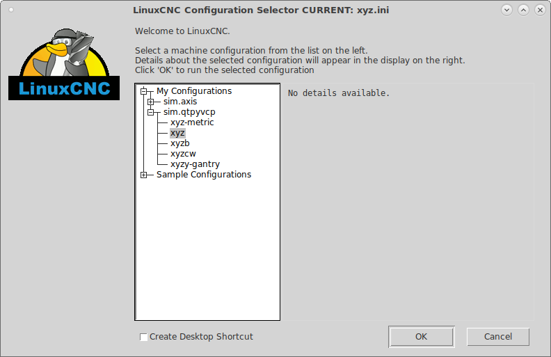
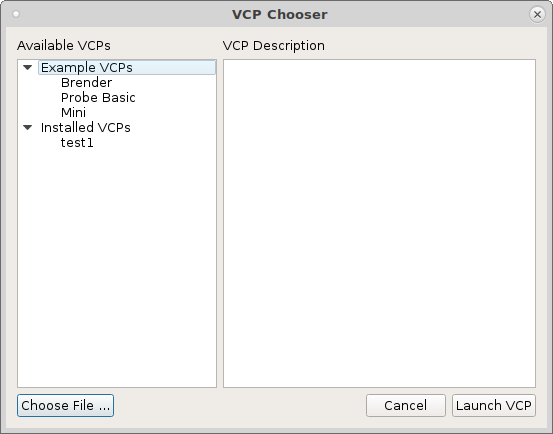

=====================
Making your first VCP
=====================

After installing and testing QtPyVCP clone the `vcp-template` then make a copy.

To copy the example template in a terminal

.. code-block:: bash

	git clone https://github.com/kcjengr/vcp-template.git
	cd vcp-template
	./copy.sh

To edit the new template created from the example

.. code-block:: bash

	editvcp

Navigate to the new vcp location and open the `config.yml` file.

.. code-block:: bash

	~/linuxcnc/configs/qtpyvcp/config_name/config_name/config.yml

The Qt Designer should open up with the VCP for editing.

Action Buttons
^^^^^^^^^^^^^^

Click on the `E-Stop` action button then scroll down in the property editor
until you find `Action Name` and you will see the name is `machine.estop.toggle`.
In the `QtPyVCP` docs QtPyVCP Actions > Machine Actions you can find the info
about `qtpyvcp.actions.machine_actions.estop`. In this case it's using the
`toggle()` function, so to use the `reset()` function you would put
`machine.estop.reset` as the `Action Name`.

Testing the VCP
^^^^^^^^^^^^^^^

To test your vcp start LinuxCNC and pick a configuration from sim.qtpyvcp

then pick your VCP from the Installed VCPs.

