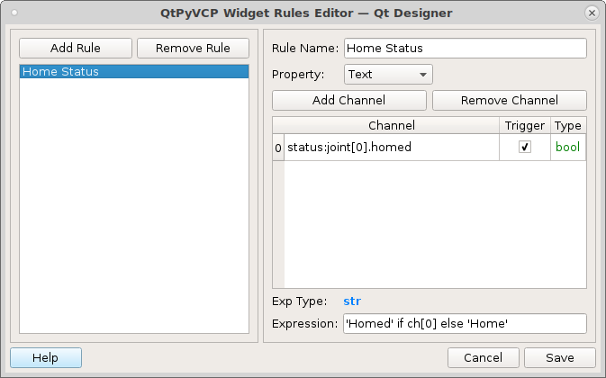

===============
Machine Buttons
===============

Lets create some jog buttons by adding some `ActionButtons` to a group box. Set
the minimum height to 50 and put the following into the `actionName`.
::

    machine.jog.axis:x,pos
    machine.jog.axis:x,neg
    machine.jog.axis:y,pos
    machine.jog.axis:y,neg
    machine.jog.axis:z,pos
    machine.jog.axis:z,neg

Now when we run the configuration we can jog and set work offsets.

.. image:: images/vcp1run-08.png
   :align: center
   :scale: 80 %

Lets add a `Home All` `ActionButton` with the `actionName` `machine.home.all`.

.. image:: images/vcp1run-09.png
   :align: center
   :scale: 80 %

Lets create a `Rule` for the Home button to change the text based on at this
time on if Axis X is homed or not. Double click on the Home button to open the
Rules Editor.

Now we need to be able to start and stop the program so add some `ActionButtons`
to a group box with the following `actionNames`
::

    program.run
    program.pause
    program.resume
    program.abort

.. image:: images/vcp1run-10.png
   :align: center
   :scale: 80 %

