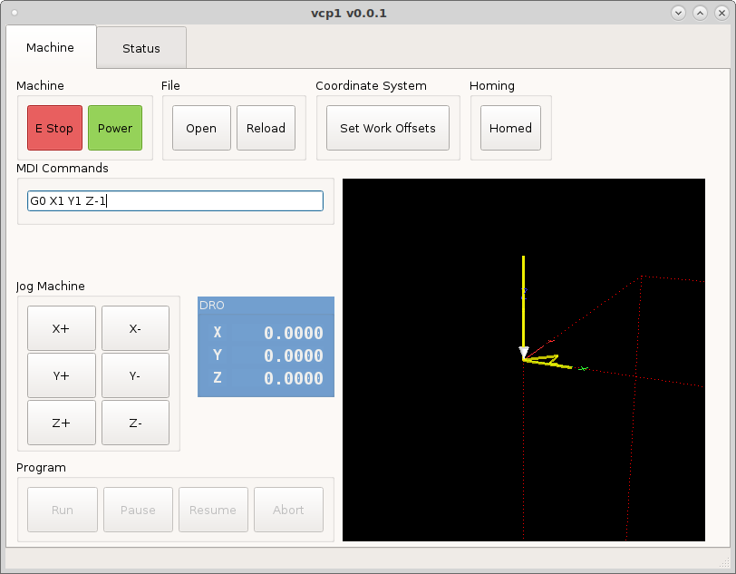
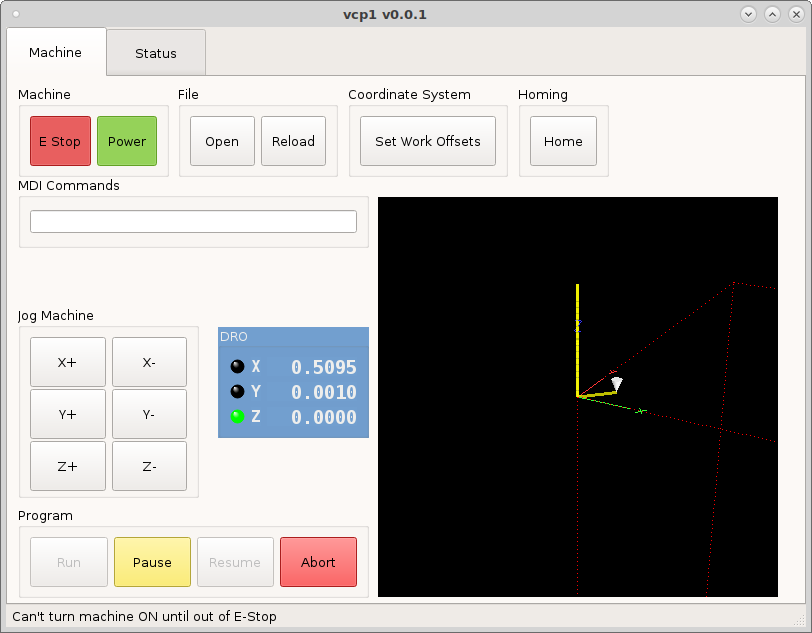
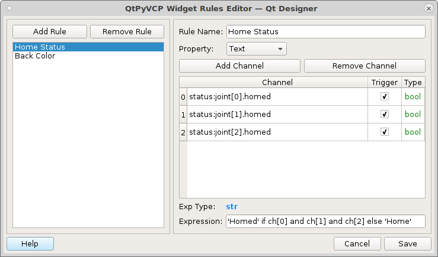
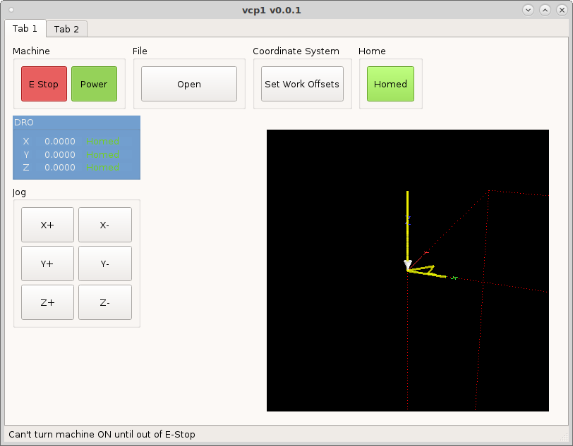
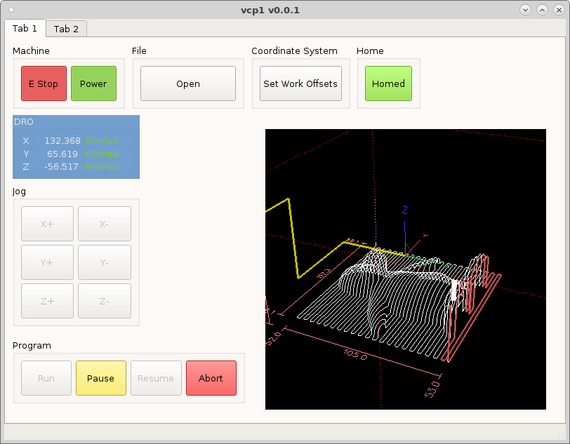

===============
Machine Buttons
===============

Lets create some jog buttons by adding some `ActionButtons` to a group box. Set
the minimum height to 50 and put the following into the `actionName`.
::

    machine.jog.axis:x,pos
    machine.jog.axis:x,neg
    machine.jog.axis:y,pos
    machine.jog.axis:y,neg
    machine.jog.axis:z,pos
    machine.jog.axis:z,neg

Now when we run the configuration we can jog and set work offsets.

Lets add a `Home All` `ActionButton` with the `actionName` `machine.home.all`.

Lets create a `Rule` for the Home button to change the text based on if all the
axes are homed or not. Double click on the Home button to open the Rules Editor.
Select the `Text` property and give the rule a name. Add three channels, one for
each axis and check trigger.
::

    status:joint[0].homed
    status:joint[1].homed
    status:joint[2].homed

The `Channel Type` is the output type of that channel, in this case it is a
`bool` which is a true or false output. So now we need a valid `Expression`. The
expression syntax is ``Do This If This is True Else Do That``. So we want to
change the text of the button if the machine is homed so the expression is: ::

    'Homed' if ch[0] and ch[1] and ch[2] else 'Home'
    'Homed' if ch[0] and ch[1] and ch[2] else 'Home All'

Notice that the button now has some text in it and it came from the rule.

Now we want to add another rule to change the color of the button when all the
axes are homed so we have a quick visual that the machine is homed. But first we
need to use a quick shortcut to get a valid markup string. So drag a text label
(it can be a regular text label) into the main window and open the `Style Sheet`
editor and add ``background-color:`` then click on the `Add Color` and pick a
color. Now make sure the validator in the lower left corner is green and says
`Valid Style Sheet`, now you know your markup is valid. Copy that string to the
clipboard.

.. image:: images/home-rule2-ss.png
   :align: center
   :scale: 80 %

Now open back up the Home button `Rules Editor` and add a new rule with the same
three channels. Pick `Style Sheet` as the property to change.

The expression is:
``"background-color:rgb(138, 226, 52)" if ch[0] and ch[1] and ch[2] else ''``.
This reads change the background color if all axes are homed else do nothing.

.. image:: images/home-rule2.png
   :align: center
   :scale: 80 %

.. image:: images/home-rule2-ss.png
   :align: center
   :scale: 80 %

Now open back up the Home button `Rules Editor` and add a new rule with the same
three channels. Pick `Style Sheet` as the property to change.

The expression is:
``"background-color:rgb(138, 226, 52)" if ch[0] and ch[1] and ch[2] else ''``.
This reads change the background color if all axes are homed else do nothing.

.. image:: images/home-rule2.png
   :align: center
   :scale: 80 %

Run the VCP and see the effects of the rules on the Home All button and the DRO
status labels.

Now we need to be able to start and stop the program so add some `ActionButtons`
to a group box with the following `actionNames`
::

    program.run
    program.pause
    program.resume
    program.abort

At this point you have a minimal functioning VCP, next we'll add the MDI Entry.
