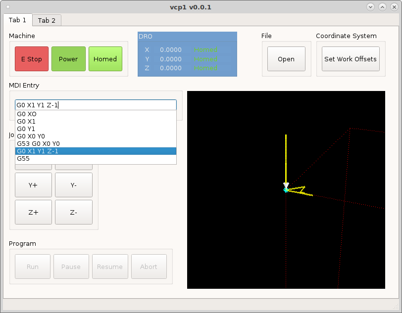

===
MDI
===

MDI or Manual Data Input is a way to run G code commands without creating a
file. QtPyVCP makes this as easy as dragging a `MDIEntry` into the VCP. A little
shuffling around to make everything fit and were done.

