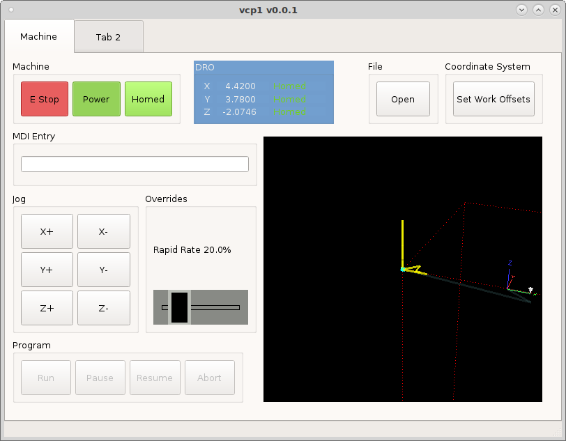

=========
Overrides
=========

To add a `Rapid Override` start by adding an `ActionSlider` to a group box.
Change the orientation to horizontal. Put ``machine.rapid-override.set`` in the
`ActionName`. Now we need to change the size of the slider and make it big
enough for a touch screen. In the stylesheet of the slider add the following.::

    .ActionSlider {
        min-height: 50px;
        max-height: 50px;
        background: rgb(136, 138, 133);
    }
    .ActionSlider::groove:horizontal {
        border: 1px solid rgb(0,0,0);
        height: 5px;
        margin: 0 12px;
    }
    .ActionSlider::handle:horizontal {
        background: rgb(0,0,0);
        border: 5px solid rgb(186, 189, 182);
        width: 23px;
        height: 100px;
        margin: -24px -12px;
    }

.. image:: images/slider-style-01.png
   :align: center
   :scale: 100 %

Now we have a slider big enough for a touch screen.

.. image:: images/vcp1-06.png
   :align: center
   :scale: 100 %

Next we need to add a status label to show the current override percentage. Add
a `StatusLabel` above the slider in the group box and create a new rule for it
and in the channel put ``status:rapidrate`` and the expression is
``'Rapid Rate ' + str(ch[0]*100) + '%'``.

.. image:: images/slider-rule-01.png
   :align: center
   :scale: 100 %

Now we can test the slider by issuing a rapid MDI command and moving the slider.

Now lets add a second slider and status label for `Feed Override`. Add the
`ActionName` ``machine.feed-override.set`` then set the orientation to horzontal
and add the same style as the first slider.

Now add the status label and create a rule as above with the channel
``status:feedrate`` and the expression is ``'Feed Rate ' + str(ch[0]*100) + '%'``.

Run the VCP and load a program to test the feed rate override slider.

.. image:: images/vcp1run-19.png
   :align: center
   :scale: 75 %

