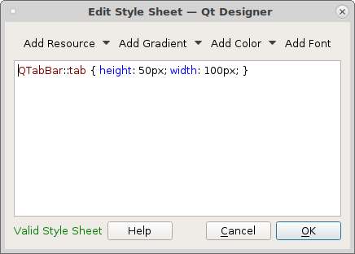

=============
Touch Screens
=============

When using touch screens you need to set the size of buttons and tabs larger
than normal.

Tabs

To set the size of tabs in a `Tab Widget` use the `tabWidget styleSheet`.
``QTabBar::tab { height: 50px; width: 100px; }`` will set the size of the tabs
larger and easier to press with your finger.

And you can see the tabs are large enough to touch with your finger on a touch
screen.

.. image:: images/vcp1run-17.png
   :align: center
   :scale: 75 %

