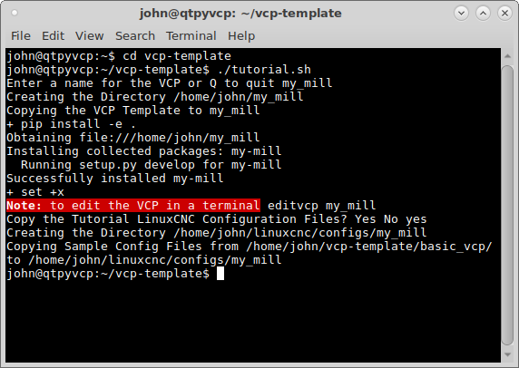

============
VCP Template
============

To get a basic framework for building a VCP after installing `QtPyVCP` from the
:doc:`../install/quick_start` page clone the
`VCP Template <https://github.com/kcjengr/vcp-template>`_ which contains the
basic framework for a QtPyVCP VCP.

Open a terminal and clone the `VCP Template` to your computer.
::

    git clone https://github.com/kcjengr/vcp-template.git

This will put a copy of the VCP Template in the `~vcp-template` directory. The
best way to use this is to run the tutorial.sh script and create a copy with
the name of your new VCP. In the terminal change to the vcp-template directory
and run the script. Note the name can be letters, numbers and the underscore.

To create a LinuxCNC simulation configuration to test your template with answer
`yes` to the prompt `Copy the Tutorial LinuxCNC Configuration Files?`
::

    cd vcp-template
    ./tutorial.sh

To edit the vcp template run ``editvcp`` and pick your template from the file
chooser.

.. image:: images/vcp-template-02.png
   :align: center
   :scale: 80 %

The vcp template will open up in the Qt Designer.

.. image:: images/vcp-template-03.png
   :align: center
   :scale: 40 %

The last step is the open the sample configuration up with `LinuxCNC` and create
a desktop shortcut.

.. image:: images/vcp-template-04.png
   :align: center
   :scale: 80 %

Now you have a VCP template that can be tested with the simulation
configuration and a desktop shortcut to launch the VCP.

.. image:: images/vcp-template-05.png
   :align: center
   :scale: 80 %

